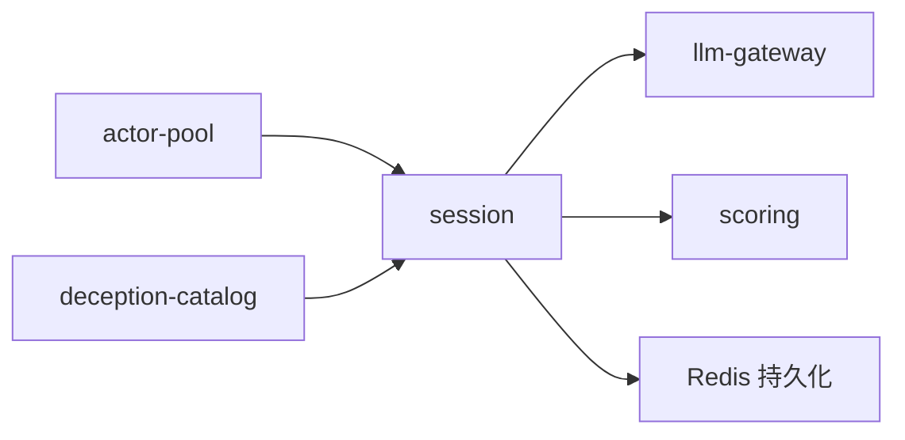

# AiSS (Ai Space System) 系統規劃

## Context

這是一份 **系統啟動前的整體規劃與架構設計文件**，不是程式實作計畫。使用者目前只有 [AiSS.md](AiSS.md) 一份願景草案，希望在開始寫任何程式碼前，先用 **設計思考（Design Thinking）五階段** 把整個系統想清楚，並確立技術選型與可行性。

**專案核心目標**：為台灣中小學生（初期以小學為主）建立一套 **遊戲式學習（Game-based Learning, GBL）** 平台，其中包含兩個主軸：

1. **AiSS 主系統**：2D 太空站/地表/實驗室探索遊戲，內含知識熱點、日常任務、LLM NPC 輔助學習。
2. **資訊判讀遊戲（InfoLit Game）**：利用 multi-agent LLM 設計「誰在胡說八道」的遊戲，訓練學生的資訊判讀能力。

**使用者已確認的決策（Phase 1 問答）**：
- **MVP 策略**：先完成 AiSS 基礎框架 → 資訊判讀遊戲作為 AiSS 內的一個模組，但 **必須同時可獨立部署** 到其他電腦/伺服器運行。
- **目標平台**：Web 瀏覽器為主，iPad / 平板為次要（需觸控友好 UX）。
- **技術堅持**：核心 Rust；周邊元件預設也用 Rust，**僅當「Rust 方案的時間成本與其他方案相差過大（顯著更慢）」時才考慮其他語言**。
- **開發者**：**個人開發**（solo dev），目標 **1–2 個月內完成**。若時間不足，**InfoLit 資訊判讀遊戲 MVP 為最高優先**，AiSS 主殼為承載平台。
- **設計思考深度**：完整五階段深入展開。
- **開發方法論**：採用 **Dual-Track Agile**（雙軌敏捷），Discovery 軌道跑 Design Thinking，Delivery 軌道跑 Scrumban，由 agile-coach agent 掌控流程。

---

## Part 1 — 設計思考五階段展開

### 1.1 Empathize（同理）

#### 目標使用者（Personas 初稿）

| Persona | 特徵 | 核心需求 | 痛點 |
|---|---|---|---|
| **小樂（Primary User）** | 小學 4–6 年級、每天看短影片、對文字閱讀易分心 | 好玩、有回饋、能和朋友一起玩 | 上課無聊、被資訊洗腦卻不自知 |
| **陳老師（Secondary）** | 小學自然 / 社會科老師 | 能指派任務、看到學生進度、素材可對應課綱 | 沒時間自己做教材、擔心 AI 幻覺誤導學生 |
| **阿嬤（Tertiary）** | 學生家長，對 AI 有疑慮 | 希望孩子學有所成、資料隱私不外洩 | 怕遊戲上癮、怕付費陷阱 |

#### 需要執行的同理研究（Phase 1 Research Plan）

- 訪談 3–5 位目標年齡學生，觀察他們判斷資訊真偽的現況（給一段混合真假訊息的影片或文章，觀察他們怎麼反應）。
- 訪談 1–2 位國小老師，了解資訊素養課綱現況與教學困難。
- **桌面研究（文件分析）**：
  - 台灣 108 課綱 **「科技資訊與媒體素養」** 核心素養對應點。
  - **教育部《AI 素養手冊》**：[pads.moe.edu.tw/download_zip.php?title_id=704](https://pads.moe.edu.tw/download_zip.php?title_id=704)
  - **[中小學生成式AI之學習應用手冊-《我和AI一起學》（國小版）](中小學生成式AI之學習應用手冊-_我和AI一起學_for國小1141230.pdf)**（已下載於專案資料夾）
  - **[中小學生成式AI之學習應用手冊-《駕馭AI，洞察未來：數位公民的必修課》（國高中版）](中小學生成式AI之學習應用手冊-《駕馭AI，洞察未來：數位公民的必修課》for國高中1141230.pdf)**（已下載於專案資料夾）
  - ✅ **實際讀取狀態（已完成）**：安裝 Poppler 25.07.0（winget 全局安裝 + 複製至 `~/.local/bin/`）後，已成功用 Read 工具讀取兩份 PDF 的影像內容，以下為直接閱讀所得。
  - **《我和 AI 一起學》（國小版）** 直接閱讀摘要：
    - 目標對象：**國小三至六年級**（與本專案 4–6 年級重疊）
    - 吉祥物：e度（學習夥伴）、歐匿（社群愛好者）、思思（容易輕信的主角）
    - 第四章 **「AI說的一定對嗎？」** ⟶ 直接對應 InfoLit 遊戲概念
      - 核心故事：歐匿差點衝動分享可疑 AI 生成圖片（引導「先暫停、再查核」）
      - **AI偏誤（AI bias）** 比喻：彩色鉛筆盒顏色不齊 → 彩虹畫不正確，即使答案聽起來合理也要保持警覺
    - 第三章「AI小任務」：強調「先自己思考，AI才能幫助學習」，不可直接複製貼上
    - 第六章「AI時代的好公民」：數位公民責任、個資保護
  - **《駕馭AI，洞察未來》（國高中版）** 直接閱讀摘要：
    - 目標對象：國中生（本專案未來延伸目標；框架可參考用於難度分層）
    - 第三章 **「AI真相秀—資訊判讀 so easy」** ⟶ 核心 InfoLit 課綱框架：
      - **三大原則**：**勿輕信**（冷靜理性中立）/ **要審視**（確認來源是否可靠）/ **勤查證**（主動核實）
      - **三問查核法**：「誰說的？」（來源可信度）/ 「何時發布？」（時效性）/ 「合不合理？」（內容邏輯）
      - **警報系統**：🔴 紅色（高度可疑）/ 🟡 黃色（部分真實需查核）/ 🟢 綠色（可信度高）
      - **關鍵概念**：同溫層效應（echo chamber）/ 慣性思維（confirmation bias）
      - **查核工具**：台灣事實查核中心 tfc-taiwan.org.tw / TinEye / MyGoPen / Cofacts / Google 事實查核工具
    - 培養「AI共學力」：操作技能 → 內容理解 → 倫理反思（三層次）
  - **InfoLit 遊戲與課綱對齊方式**（直接讀取後確認）：
    - 遊戲中學生的「三問追問法」對應手冊「三問查核法」
    - 遊戲結算的「評分警報」對應手冊「紅/黃/綠警報系統」
    - 騙術清單的分類對應手冊「AI偏誤 / 同溫層效應 / 慣性思維」等概念
    - 題目設計依據：手冊中的「誰說的 / 何時發布 / 合不合理」為三個基本評判維度
- **競品分析**：待進入 Discovery Sprint 時再執行（`business-analyst` agent 已列為 deferred）。分析標的至少包含：因材網、PaGamO、Prodigy Math、Scratch、ai-town demo、Khan Academy Kids、均一教育平台、Duolingo Math。

> **Skill 建議**：之後若要做實地研究，可考慮一個 `user-research-interview` skill 協助生成訪談大綱、觀察表、逐字稿分析框架。

### 1.2 Define（定義）

#### POV 陳述（Point of View）

> **小樂** 需要一種 **不像上課的方式練習判讀網路資訊**，因為他 **每天接觸大量未經查證的短影音內容，卻從未被教過如何分辨真假**。

> **陳老師** 需要一套 **能自動對應課綱、可追蹤學生表現的數位教材**，因為 **她沒時間從零製作資訊素養教案，又擔心直接讓學生用 ChatGPT 會被幻覺誤導**。

#### HMW（How Might We）核心問題

1. **HMW-1**：我們如何讓小學生在「玩遊戲」的過程中，自然而然養成「質疑與查證」的思維？
2. **HMW-2**：我們如何讓 LLM NPC 既能個人化陪學，又不會對學生散播錯誤資訊？
3. **HMW-3**：我們如何設計一個遊戲，讓 **AI 故意胡說八道** 變成一種可控、可學習的訓練素材，而不是資訊災難？
4. **HMW-4**：我們如何讓資訊判讀遊戲既能嵌入 AiSS 大宇宙，又能獨立存在於學校電腦教室？
5. **HMW-5**：我們如何用最低的認知負擔，讓 4 年級學生在 **網頁鍵盤（WASD / 方向鍵）為主要操作**、同時又能順暢適配 iPad 觸控的環境下完成探索與對話？

### 1.3 Ideate（發想）

#### 功能主題分類

**A. 探索（Exploration）**
- 主地圖：太空站（起始區 / 艙房 / 指揮室 / 任務中心）
- 地表地圖：中央大學、南極冰川、澳大利亞內陸、美國大峽谷（依新地圖節奏更新）
- 實驗室地圖：對應特定學科的 mini-game 入口
- **知識熱點（Knowledge Hotspot）**：互動式物件，觸發小測驗、動畫解說、或 NPC 對話
- **彩蛋（Easter Eggs）**：鼓勵探索的隱藏元素

**B. 日常（Daily Loop）**
- 每日任務、經驗值、系列課程完成獎勵
- 題目回答系統（學過的 / 最近的 / 常識性主題）
- 重複觀看遞減經驗值機制（防刷）

**C. 社交（Social）**
- 班級系統（獨立休息室、太空站空間站聚會）
- 多人線上活動

**D. 資訊判讀遊戲（InfoLit Game）— 新重點**
- **玩法原型**：學生進入一間「線上會議室」，與 3–5 個 AI NPC 討論某個主題（例：「海豚其實是魚類嗎？」「微波爐加熱食物會讓食物帶有輻射嗎？」）。其中 1–2 個 NPC 被設定會「有策略地說謊」——可能提供似是而非的論點、偽造的引用、或邏輯跳躍。
- **學生任務**：在時間限內，透過追問、比對、要求出處，找出「騙子」並說明理由。
- **學生工具箱（對應手冊三問查核法）**：
  - 可向任何 NPC 追問「你的資料來源是什麼？」（對應「誰說的？」）
  - 可追問「這個說法是最近的嗎？」（對應「何時發布？」）
  - 可追問「這合理嗎？有沒有反例？」（對應「合不合理？」）
- **評分機制（對應手冊警報系統）**：
  - 找對騙子 + 理由正確（引用具體不合理處）→ 🟢 高分
  - 找對但理由模糊 → 🟡 中分
  - 找錯 → 🔴 需重新挑戰，系統提示「哪裡可以多追問？」
- **分級挑戰**：
  - 初階：謊言很明顯（事實錯誤，對應「自信的錯誤事實」騙術）
  - 中階：混雜真偽（7 分真 + 3 分假，對應「斷章取義」「偽造引用」）
  - 高階：邏輯謬誤、以偏概全、情緒訴求、氣場壓制（對應 affinity 10-12 區騙術）
- **課綱對接（已直接讀取手冊確認）**：
  - 對應 108 課綱「科技資訊與媒體素養」核心素養
  - 遊戲三問追問 ⟺ 手冊「三問查核法」（誰說的/何時發布/合不合理）
  - 遊戲評分警報 ⟺ 手冊「紅/黃/綠警報系統」
  - 騙術清單 ⟺ 手冊「AI偏誤、同溫層效應、慣性思維」等概念
  - 教師說明文字、家長說明文字的用語對齊手冊（非技術描述）

**E. NPC 系統**

所有 NPC 對話 **都是自由輸入的空白對話框**，沒有預設選項。

##### E-1. 學習輔助 NPC
- **介面**：空白對話輸入框
- **功能**：回答學習操作問題、提供導覽、hyper-link 跳轉
- **特性**：無對話次數上限（玩家想問多久就多久）、可隨時關閉

##### E-2. 背景 NPC（劇情 / 探索用）
- **介面**：空白對話輸入框
- **特性**：有個性、記憶、對玩家行為做出反應
- **對話結束判斷（重要）**：每次玩家送訊息後，NPC 後端判斷以下條件，任一滿足則自動結束對話並關閉對話框：
  1. **離題偵測**：玩家輸入與 NPC 的「話題範圍（topic_scope）」相關度低於門檻（例如用 embedding 相似度 <0.3）
  2. **對話次數上限**：`turn_count > max_turns`（每個 NPC 可自訂，預設例如 10 回合）
  3. **任務已交代完畢**：NPC 的「任務清單（task_list）」全數 `done`（由 NPC 判斷 task 是否完成）
- **技術實作**：
  - NPC YAML 加欄位：`topic_scope`、`max_turns`、`task_list`
  - 背景跑一個「關閉判官（exit_judge）」子 agent，每回合評估並輸出 `{should_close: bool, reason: enum}`
  - 若 `should_close = true`，前端顯示 NPC 最後一句對白後淡出對話框（例如「好了，我得去忙了，再見！」或「你問的跟這個話題沒什麼關係欸⋯」）
- **NPC YAML 範例**：
```yaml
id: "npc-captain-zhang"
name: "張艦長"
topic_scope: ["太空站歷史", "艦長工作", "指揮室規則"]
max_turns: 8
task_list:
  - id: "intro_station"
    description: "向玩家說明太空站的用途"
    done: false
  - id: "point_to_lab"
    description: "告訴玩家實驗室在哪個方向"
    done: false
```

##### E-3. InfoLit 遊戲中的 NPC（演員）
- 見 [Part 3.2.3](#323-multi-agent-編排層演員列表-騙術清單-時間節奏)，由演員池 + 騙術清單 + pacing 驅動

##### E-4. 防幻覺機制（Anti-hallucination Guardrails）
- NPC 回答須通過知識庫比對（RAG），超出範圍則轉為「我不確定，一起查查看」模式
- 系統 prompt 封印：NPC 絕對不能輸出自己的系統指令內容
- 輸出後再經過一層審核：規則 filter + 輕量 LLM 二審，過濾內部訊息、隱私資料、不當主題

### 1.4 Prototype（原型）

此階段的產出是 **技術原型計畫**，實際程式碼在計畫通過後才實作。

#### 原型優先順序（Prototype Priorities）

1. **Spike-1：InfoLit Game 核心迴圈**（1–2 週）
   - 最小可玩：3 個 CLI/Web 文字聊天 agent + 1 個「裁判」評分器 + 1 題題庫
   - 驗證 multi-agent 框架選型（Rig vs AutoAgents）
2. **Spike-2：AiSS 地圖載入 + 角色移動**（1–2 週）
   - Tiled → JSON → 渲染 → WebSocket 位置同步
   - 驗證前端方案（PixiJS vs Bevy-wasm）
3. **Spike-3：模組化邊界驗證**
   - 能否讓 InfoLit Game 同時以「AiSS 內嵌模組」和「獨立 docker-compose」兩種方式運行

### 1.5 Test（驗證）

| 測試類型 | 對象 | 方法 | 成功指標 |
|---|---|---|---|
| **可玩性測試** | 3–5 位小四到小六學生 | 紙上原型 → 低保真 demo → 觀察遊玩 | 80% 學生能在無提示下完成一輪 InfoLit 遊戲 |
| **教育有效性** | 同一批學生，前後測 | 前測資訊判讀題 → 玩 5 次遊戲 → 後測 | 後測分數提升 ≥15% |
| **老師可用性** | 2 位教師 | 操作任務指派、檢視學生報表 | SUS 分數 ≥70 |
| **技術壓測** | 模擬 100 人同時在線 | k6 / Locust 腳本 | p95 延遲 <200ms，agent 回應 <3s |
| **防幻覺** | InfoLit NPC | 紅隊測試：嘗試讓「誠實 NPC」散播假資訊 | 誠實 agent 幻覺率 <2% |

---

## Part 2 — 系統架構

### 2.1 架構總覽（Modular Monolith 風格）

關鍵原則：**InfoLit Game 必須是「可拔插」模組** — 既能作為 AiSS 內的一個場景，也能獨立以 `infolit-standalone` 部署運行。

```
┌──────────────────────────────────────────────────────────────┐
│  Frontend (TypeScript + PixiJS + React UI overlay)          │
│  ┌────────────┐  ┌────────────┐  ┌──────────────────────┐   │
│  │ AiSS Shell │  │ Map Render │  │ InfoLit Game Widget  │   │
│  └────────────┘  └────────────┘  └──────────────────────┘   │
└─────────────┬────────────────────────────────────────────────┘
              │ WebSocket (game state) + HTTPS REST
┌─────────────▼────────────────────────────────────────────────┐
│  AiSS Backend (Rust, Axum + Tokio — 全異步)                 │
│  ┌────────────────┐  ┌────────────────┐  ┌───────────────┐  │
│  │ Auth / Session │  │ Simulation Eng │  │ Progress API  │  │
│  │ (OAuth2, JWT)  │  │ (ECS, tick)    │  │ (XP, Quest)   │  │
│  └────────────────┘  └────────────────┘  └───────────────┘  │
│  ┌────────────────┐  ┌────────────────┐  ┌───────────────┐  │
│  │ Map/Asset API  │  │ NPC Dialog Svc │  │ Event Bus     │  │
│  │ (REST)         │  │ (LLM proxy)    │  │ (NATS)        │  │
│  └────────────────┘  └────────────────┘  └───────────────┘  │
└─────────────┬────────────────────────────┬───────────────────┘
              │ 內部 NATS message bus      │
┌─────────────▼────────────┐  ┌────────────▼──────────────────┐
│  InfoLit Game Service    │  │  LLM Gateway (Rust)           │
│  (Rust, 獨立可部署)      │  │  - 自寫 AgentRunner           │
│  - Session manager       │  │  - Prompt caching             │
│  - Agent persona store   │  │  - Guardrails / fact-check    │
│  - Lie scheduler         │  │  - zh-TW instruction enforcer │
│  - Judge / Scoring       │  │  - Ollama / OpenAI / Anthropic│
└──────────────────────────┘  └───────────────────────────────┘
              │                            │
┌─────────────▼────────────────────────────▼───────────────────┐
│  Data Layer                                                  │
│  ┌──────────────┐  ┌──────────────┐  ┌──────────────────┐   │
│  │ PostgreSQL   │  │ pgvector     │  │ S3 / MinIO       │   │
│  │ (state, user)│  │ (memory/RAG) │  │ (maps, assets)   │   │
│  └──────────────┘  └──────────────┘  └──────────────────┘   │
└──────────────────────────────────────────────────────────────┘
```

### 2.2 模組化邊界（可拔插設計）

**InfoLit Game Service** 是一個獨立的 Rust crate / binary，透過 trait 抽象與 AiSS 解耦：

```rust
// pseudo-code
pub trait HostEnvironment {
    fn get_user(&self) -> UserContext;    // 從 AiSS 或 standalone auth
    fn report_progress(&self, result: GameResult); // 寫回 AiSS 或本地 DB
    fn get_topic(&self) -> Topic;         // 從課綱服務或內建題庫
}

// 兩種實作：
// 1. AiSSHost      —— 透過 gRPC 呼叫 AiSS 後端
// 2. StandaloneHost —— 用內建 SQLite + 簡易 JWT
```

**部署模式**：
- **整合模式**：`docker compose up aiss` — 啟動完整系統
- **獨立模式**：`docker compose up infolit-standalone` — 只啟動 InfoLit + 輕量 auth + SQLite + 靜態前端

### 2.3 地圖工作流（保留自 ai-town 的理念）

- 用 [Tiled Map Editor](https://www.mapeditor.org/) 繪製地圖，輸出 `.tmj` (JSON) + tileset `.png`
- Rust 側寫一個 `map-compiler` 工具：`tiled json + png → 遊戲用的 packed 格式`
- 前端載入時直接渲染，不做可持續發展的複雜地形演算
- 場景切換 = 換 map ID

---

## Part 3 — 技術選型與可行性分析

### 3.1 後端核心（Rust）

| 功能 | 選型 | 理由 | 備案 |
|---|---|---|---|
| Web 框架 | **Axum** | 官方 tokio 生態、中介層乾淨、WebSocket 成熟 | Actix-web |
| Async runtime | **Tokio** | 事實標準 | — |
| 序列化 | **serde + serde_json** | 事實標準 | rkyv（高效能場合） |
| ORM / DB | **sqlx (PostgreSQL)** | 編譯期 SQL 檢查，不強迫 ORM 抽象 | SeaORM |
| Vector search | **pgvector** | 與主 DB 整合，省一個服務 | Qdrant（Rust） |
| 即時通訊 | **Axum WebSocket + tokio-tungstenite** | 與 Axum 無縫整合 | — |
| REST API | **Axum Router** | 與框架一體、異步原生、KISS 原則；**GraphQL 不採用** | — |
| Message bus | **NATS（async-nats）** | 輕量、Rust client 官方維護、JetStream 支援持久化；**Kafka 不採用**（overkill）；RabbitMQ 為備案 | Redis Streams |
| Auth | **oauth2 + jsonwebtoken crates** | **優先整合 Google OAuth，最小化個資自持** — 只保存 provider ID + displayName | Keycloak（外部服務） |
| 遊戲 ECS / 模擬 | **bevy_ecs**（只用 ECS 部分，不用渲染） | 高效能、社群活躍 | hecs |

### 3.2 LLM Gateway 與 Multi-Agent 編排

#### 3.2.1 設計原則：**Provider 抽象層 > 特定框架**

（採納使用者經驗教訓：曾因不同 LLM provider 的資料格式差異而「翻車」。）

**核心原則**：
1. **預設自架 / 地端 LLM**：以 **Ollama** 為主要 provider，避免將學生資料送出境外。
2. **可插拔 Provider Trait**：所有 LLM 呼叫都經過一層抽象，切換 provider 只需實作 trait、不動上層邏輯。
3. **正規化訊息格式**：內部使用單一 `ChatMessage` / `ChatRequest` / `ChatResponse` 結構，各 provider 的 adapter 負責翻譯。
4. **保留欄位（forward-compat）**：訊息結構加 `extensions: HashMap<String, Value>` 容納各家特殊參數（如 Anthropic 的 cache control、OpenAI 的 logit_bias），避免未來加欄位時大改。
5. **嚴格界定信任邊界**：若使用雲端 provider，必須是「單一信任方」且有明確資料處理合約。

#### 3.2.2 Rust trait 設計草案

```rust
#[async_trait]
pub trait LlmProvider: Send + Sync {
    fn name(&self) -> &'static str;
    fn capabilities(&self) -> ProviderCapabilities;  // tool_use / streaming / vision / json_mode
    async fn chat(&self, req: ChatRequest) -> Result<ChatResponse, LlmError>;
    async fn chat_stream(&self, req: ChatRequest) -> Result<BoxStream<ChatChunk>, LlmError>;
    async fn embed(&self, texts: &[String]) -> Result<Vec<Embedding>, LlmError>;
}

pub struct ChatRequest {
    pub model: String,
    pub messages: Vec<ChatMessage>,
    pub system: Option<String>,
    pub tools: Vec<ToolDef>,
    pub temperature: Option<f32>,
    pub max_tokens: Option<u32>,
    pub extensions: HashMap<String, serde_json::Value>,  // provider 特殊參數
}

// 各 adapter 實作：
// - OllamaProvider    (Rust, reqwest, 預設主力)
// - OpenAiProvider    (Rust, async-openai 或自己寫)
// - AnthropicProvider (Rust, 手寫 reqwest adapter)
// - vLlmProvider      (Rust, 自架 vLLM OpenAI 相容端點)
// - TextGenInferenceProvider (Hugging Face TGI)
```

#### 3.2.3 Multi-Agent 編排層：演員列表 × 騙術清單 × 時間節奏

**核心設計哲學**：把「角色」與「行為」解耦，用組合產生多樣性。

##### A. Actor Pool（演員列表）

每個演員是一筆 YAML 資料，**加上「向性（affinity）」數字描述他適合哪類騙術**：

```yaml
# content/infolit-questions/actors/actor-001.yaml
id: "actor-dr-lin"
name: "林博士"
avatar: "scientist_female.png"
short_bio: "自稱海洋生物學家，總愛引用奇怪的研究"
personality_traits:
  - "喜歡用專業術語"
  - "常常說『我上次在研討會聽到⋯』"
  - "口氣很有信心"
speech_style: "正式、帶點學究氣"
voice_hint: "zh-TW, 中年女性, 平穩"
# 向性（affinity）：1–12 的整數，三個錨點為 3 / 6 / 9
# 3 = 情感訴求（pathos）   → 恐懼、煽情、鼓舞
# 6 = 邏輯操弄（logos）   → 斷章取義、假邏輯、以偏概全
# 9 = 權威引用（ethos）   → 假引用、偽裝專家、名牌加持
# 10–12 = 超出典型權威區（越偏離 9，「正式權威感」越少）
#   例：affinity=10 是「略帶怪咖感的偽學者」，12 是「完全靠氣場的神棍型」
# 數字接近度決定加權，但保留 15% 完全隨機例外通道
affinity: 9
```

##### B. Deception Catalog（騙術清單）

每個騙術是一種「說謊的方式」：

每個騙術同樣有 `affinity` 值，與演員的數字**越接近越容易被選中**：

```yaml
# content/infolit-questions/deception-patterns/pattern-001.yaml
id: "fake-citation"
name_zh: "偽造引用"
description: "引用不存在的研究、期刊、專家名字來支撐錯誤結論"
example: "根據 2023 年哈佛大學一項研究..."
difficulty: "medium"
teaching_goal: "訓練學生學會查證資料來源（對應手冊「誰說的？」三問查核法）"
affinity: 9   # 錨點 9 — 權威/引用面向

# pattern-002.yaml
id: "cherry-picking"
name_zh: "斷章取義"
description: "只挑對自己論點有利的片段，忽略反證"
difficulty: "hard"
teaching_goal: "訓練學生看全局、避免慣性思維（對應手冊「同溫層效應」概念）"
affinity: 6   # 錨點 6 — 邏輯操弄面向

# pattern-003.yaml
id: "confident-wrong-fact"
name_zh: "自信的錯誤事實"
description: "用非常肯定的語氣講一個錯誤的基本事實"
difficulty: "easy"
teaching_goal: "訓練學生不被語氣所迷惑（對應手冊「合不合理？」三問查核法）"
affinity: 6   # 錨點 6，但偏語氣（過渡區 5–7 都合理）

# pattern-004.yaml
id: "fear-appeal"
name_zh: "恐懼訴求"
description: "強調某行為的嚴重後果來嚇唬聽眾，跳過實證環節"
difficulty: "medium"
teaching_goal: "訓練學生分辨情緒與證據（對應手冊「勿輕信」原則）"
affinity: 3   # 錨點 3 — 情感訴求面向

# pattern-005.yaml（1-12 特有：10-12 區）
id: "charisma-override"
name_zh: "氣場壓制"
description: "不提任何證據，純粹靠自信語氣和魅力讓聽眾「感覺」他是對的"
difficulty: "medium"
teaching_goal: "訓練學生不被魅力型說話者說服（對應手冊「要審視」原則）"
affinity: 11  # 10-12 區：超出典型權威，靠純氣場（無學術包裝）
```

##### B-1. Affinity 維度設計（已定案：1-12 一維三錨點）

**已定案設計**：**數值從 1 到 12，三個錨點為 3 / 6 / 9**。

```
1──────────3──────────6──────────9──────────12
        情感訴求    邏輯操弄   權威引用    權威遞減區
        (pathos)   (logos)    (ethos)   （超出典型權威）
```

**10–12 的語義**（使用者確認的設計）：
- 越偏離 9，「正式學術/社會權威感」越少
- 10：「帶點怪咖感的偽學者」— 有頭銜但聽起來不太正常
- 11：「靠氣場說話的魅力型人物」— 完全不引用，靠自信壓場
- 12：「神棍型」— 訴諸神秘感、不可言說的「真理」，超越常理

**為什麼 1-12 比 1-9 更好**：
- 9 作為「權威」錨點在數字軸末端，沒有空間容納「超出典型權威」的角色
- 10–12 讓「氣場壓制」「神棍說法」這類難歸類的騙術有了家
- 整體分布更自然：情感(3) ─ 邏輯(6) ─ 正式權威(9) ─ 魅力型(12)，等距分佈
- 加權公式不變，只是定義域從 [1,9] 擴展到 [1,12]

**方案比較（留存供未來參考）**：

| 方案 | 優點 | 缺點 | 建議 |
|---|---|---|---|
| **✅ 一維 1-12，錨點 3/6/9（已定案）** | 涵蓋魅力/神棍型；過渡值自然 | 無法表達「同時情感+權威」 | ✅ **現行設計** |
| **一維 1-9，錨點 3/6/9** | 簡單 | 9 在末端，10+ 無法表達 | ❌ 已棄用 |
| **二維座標**（情感 × 邏輯） | 可表達複合型 | 資料量暴增、評分解釋困難 | ⏳ 等題庫 >30 個騙術再考慮 |

##### B-2. 錨點命名的替代提案（回答使用者「有沒有其他想法」）

**現行錨點**：3 情感訴求 / 6 邏輯操弄 / 9 權威引用

**思考過的替代（分享給你比較）**：

| 提案 | 三個錨點 | 優點 | 缺點 |
|---|---|---|---|
| **A（現行）** | 情感 / 邏輯 / 權威 | 對應亞里斯多德的 pathos / logos / ethos，教育界熟悉 | 某些騙術難歸類（例：陰謀論） |
| **B** | 情緒煽動 / 語言模糊 / 來源造假 | 更貼近實際假訊息手法 | 「語言模糊」與「邏輯操弄」有重疊 |
| **C** | 訴諸感性 / 訴諸常識 / 訴諸權威 | 都是「訴諸⋯」排比好記 | 「訴諸常識」涵蓋不夠廣 |
| **D**（建議考慮） | **情感** / **事實扭曲** / **權威包裝** | 對應小學生能理解的三種「騙人的方式」：讓你覺得怕 / 講錯的事 / 裝很厲害 | 「事實扭曲」涵蓋邏輯 + 斷章取義 |

**我的推薦**：
- **正式定稿前暫用 A（亞里斯多德三分法）**，因為學術與教育界有共通語言
- **實際給小學生看的介面文字用 D 的白話版**（「情感式」「事實式」「權威式」）
- 內部 system prompt / 題庫 YAML 用 A，UI / 教師後台 / 家長說明用 D
- 等你累積 20+ 騙術後再重新檢視是否要升級成二維

> 不過這只是我的看法，你有任何想法都歡迎覆寫。

##### C. Session 組裝邏輯（含 affinity 加權挑選）

每開一場遊戲，遊戲後端會：

1. 從 `actor-pool` 隨機抽 3–5 個演員
2. 指派其中 1–2 個演員為「騙子」
3. **為每個騙子挑選騙術（affinity 加權）**：
   - 計算該演員的 `affinity` 與每個 deception pattern 的 `affinity` 的距離：`distance = |actor.affinity - pattern.affinity|`
   - 把距離轉成權重：`weight = 1 / (1 + distance)`（越近越高）
   - 使用加權隨機（weighted random）挑出一個騙術
   - **保留例外通道**：有 15% 機率完全隨機從全部騙術挑（確保同個演員在不同場次能演出不同風格，也避免 metagame）
4. 選定一個討論主題（從題庫抽，排除宗教、政治）
5. 組裝每個演員的 system prompt：
   - `{人設}` + `{個性特質}` + `{說話風格}` + `{本輪主題}` + `(若是騙子) {騙術指令}`
6. 啟動對話迴圈

**Rust 虛擬碼**：
```rust
fn pick_deception(actor: &Actor, catalog: &[DeceptionPattern]) -> DeceptionPattern {
    if rng.gen_bool(0.15) {
        // 15% 完全隨機
        return catalog.choose(&mut rng).unwrap().clone();
    }
    // 85% 按 affinity 加權
    let weights: Vec<f32> = catalog
        .iter()
        .map(|p| 1.0 / (1.0 + (actor.affinity as i32 - p.affinity as i32).abs() as f32))
        .collect();
    let dist = WeightedIndex::new(&weights).unwrap();
    catalog[dist.sample(&mut rng)].clone()
}
```

```rust
// pseudo-code
pub struct GameSession {
    pub session_id: Uuid,
    pub actors: Vec<Actor>,
    pub liars: Vec<ActorId>,
    pub deceptions: HashMap<ActorId, DeceptionPattern>,
    pub topic: Topic,
    pub judge: JudgeAgent,
    pub transcript: Vec<ChatTurn>,
    pub pacing: PacingConfig,
}

impl GameSession {
    pub fn compose_system_prompt(&self, actor: &Actor) -> String { ... }
    pub fn advance_turn(&mut self) -> Result<ChatTurn, GameError> { ... }
}
```

##### D. 節奏控制（Pacing）

避免對話太快讓學生反應不過來，且增加沉浸感：

```rust
pub struct PacingConfig {
    /// 演員回應前的「思考延遲」，毫秒
    pub min_response_delay_ms: u64,   // e.g. 1500
    pub max_response_delay_ms: u64,   // e.g. 3500
    /// 每輪對話的最小間隔
    pub min_turn_interval_ms: u64,    // e.g. 2000
    /// 訊息逐字顯示速度（打字機效果）
    pub typewriter_cps: u32,          // e.g. 30 chars/sec
    /// 學生輸入的最小思考時間（防狂按）
    pub min_student_input_ms: u64,    // e.g. 500
}
```

**實作層級**：
- Server 端：每個 agent 回應後延遲 `rand(min, max)` 毫秒才送 WebSocket
- 客戶端：接收到訊息後，打字機逐字顯示
- 兩層配合能產生「真實對話在發生」的節奏感

##### E. 編排器選型結論

- **自寫輕量 Runner（推薦）**：`AgentRunner` 管理 session、pacing、記憶、工具呼叫。對 provider 差異的耐受度最高，且可完全控制節奏。
- **備用：[Rig](https://rig.rs)** — 可參考其設計，但不強制引入。
- **備用：[rs-graph-llm](https://github.com/a-agmon/rs-graph-llm)** — 若狀態機複雜到需要圖形化工作流再引入。

> 結論：**先自寫 provider trait + AgentRunner（含 pacing）**，不綁任何外部 agent 框架。

#### 3.2.4 預設部署模型（假設硬體：2× RTX 4090, 48GB VRAM 總量，但與其他 LLM 共享）

因為有其他模型佔用 GPU，**實際可用 VRAM 應假設 ≤ 24GB**（單卡），所以選型偏向 **14B 以下量化模型**：

| 用途 | 模型建議 | VRAM（量化後約） | 部署方式 |
|---|---|---|---|
| InfoLit 對話 agent（要求 zh-TW 流暢） | `Qwen2.5:14b-instruct-q4_K_M` / `TAIDE-LX-7B-Chat` | ~9 GB / ~5 GB | Ollama local |
| 判官 agent（需可靠 JSON 輸出） | `Qwen2.5:14b-instruct-q4_K_M` | ~9 GB | 共用同一實例 |
| 背景 NPC exit_judge（輕量） | `Qwen2.5:3b-instruct-q4_0` | ~2.5 GB | Ollama local |
| Embedding（知識庫 RAG） | `bge-m3` / `jina-embeddings-v3` | ~2 GB | Ollama local |
| 輸出審核二審（輕量） | 規則引擎 + `Qwen2.5:3b` | 共用 | Ollama local |

**多模型同時存在的策略**：
- Ollama 支援 model swap（記憶體滿時自動卸載最不常用的）
- 若要維持低延遲，可固定常駐 **主對話模型（14B）+ 嵌入模型** 在 VRAM，其他按需載入
- 若 2×4090 中有一張被外部程式長期佔用，主對話模型要降到 7B-q4（確保全程可用）
- **提供一個設定檔層**讓使用者切換「高品質模式 / 低資源模式」

**注意**：模型選型屬於實作期決策，上述只是起點。Provider trait 設計完成後，換模型應該是改一行設定。

### 3.3 前端

| 項目 | 選型 | 理由 |
|---|---|---|
| 遊戲渲染 | **PixiJS v8** | 2D tile-map 最成熟、ai-town 也用它、鍵盤與觸控支援皆良好 |
| UI 覆蓋層 | **React + TypeScript** | 元件庫豐富、對話 UI 快速開發 |
| 狀態管理 | **Zustand** | 輕量、與 React 配合佳 |
| 樣式 | **Tailwind CSS** | 快速、與 ai-town 原專案一致 |
| 建置 | **Vite** | 快、HMR 好 |
| 封裝 | **PWA（Progressive Web App）** | 網頁優先，iPad 可加入主畫面 |

**操作設計原則（鍵盤與觸控並重 — First-class Dual Input）**：

考量未來觸控（iPad）可能成為主要使用環境，**鍵盤與觸控兩者都必須是 first-class 體驗**，不可為任一方犧牲另一方。

**對話介面**：**沒有預設選項、沒有選項卡片、沒有數字快捷鍵**，所有 NPC 對話都是**一個空白輸入框**，玩家自由打字。這意味著：
- 學生必須自己想「要問什麼」，而不是從 3 個選項挑一個
- 這強化資訊判讀能力（要學會主動追問、要求出處）
- InfoLit 遊戲核心也是這個自由問答機制

1. **鍵盤操作**
   - **移動**：WASD / 方向鍵（增加「進入太空站」的臨場感）
   - **與 NPC/熱點互動**：**空格鍵**（觸發「開始對話」或「閱讀熱點」）
   - **關閉對話 / 返回**：Esc
   - **送出訊息**：Enter（對話框內）
   - **換行**：Shift + Enter
2. **滑鼠操作**
   - 點擊 NPC、熱點、對話框、送出按鈕 — 與鍵盤平行，不是次要
3. **觸控操作**（同樣 first-class，但**只在觸控螢幕才顯示**）
   - **移動**：螢幕左半邊虛擬搖桿（常駐）
   - **與 NPC/熱點互動**：右下醒目的「互動按鈕」（等同空格鍵）；也可直接點 NPC
   - **對話輸入**：點擊對話框喚起系統鍵盤，支援中文注音 / 拼音
   - **手勢**：避免多指手勢，小學生難掌握
4. **裝置偵測（重要）**
   - **非觸控螢幕不顯示任何觸控 UI 元件**（沒有虛擬搖桿、沒有互動按鈕）
   - 偵測方式：結合 `matchMedia('(pointer: coarse)')`、`'ontouchstart' in window`、Pointer Events 的 `pointerType`
   - 偵測結果存入 `InputMode` state，決定 UI 元件是否 mount
   - 若偵測錯誤，預留設定選單可手動切換
5. **響應式佈局**
   - 桌面 ≥1024px：鍵盤模式為主
   - 平板 768–1023px：觸控模式為主（若為觸控裝置）
   - 手機 <768px：顯示「建議使用平板或電腦」但仍可用
6. **輸入抽象層（InputAdapter）**
   - 建立 `InputAdapter` 模組，把鍵盤 / 滑鼠 / 觸控統一成 `GameInput` 事件（`Move(dx, dy)`、`Interact`、`Cancel`、`SubmitText(s)`）
   - 遊戲邏輯完全不知道使用者用什麼裝置，只處理 `GameInput`
   - **自動偵測設備類型**切換對應 UI 配置；支援同一裝置混用（例如 iPad 外接鍵盤）
7. **早期測試**：Milestone 1 就要在「桌機 + 鍵盤」和「iPad + 觸控」兩個環境各測一次。

### 3.3.1 全 Rust 前端可行性分析（Full-Rust Option）

使用者問：**「如果把整個系統使用 Rust 開發的話會有什麼影響？」**

本節分析前端從 TypeScript + PixiJS + React 改為全 Rust（Bevy WASM / Leptos / Dioxus / Yew）的完整影響。

#### A. 可選的 Rust 前端框架

| 框架 | 定位 | 對本專案的意義 |
|---|---|---|
| **Bevy（WASM）** | 遊戲引擎，全 Rust | AiSS 2D tile 渲染選項；web 部署測試案例少 |
| **Leptos** | 全端 Rust Web（signal-based，SSR + 水合） | InfoLit 對話 UI 的最佳 Rust 選項 |
| **Dioxus** | React-like，多平台（web / desktop / mobile） | 生態較 Leptos 小，但未來桌機版有吸引力 |
| **Yew** | React-like WASM | 生態較成熟，但開發體驗不如 Leptos |

#### B. 關鍵指標對比

| 面向 | TS + PixiJS + React（現行） | Bevy WASM | Leptos |
|---|---|---|---|
| **2D tile 渲染成熟度** | ⭐⭐⭐（PixiJS 業界標準）| ⭐⭐（bevy_ecs_tilemap 可用，但 web 坑多）| ❌（UI 框架，非遊戲引擎）|
| **中文 IME（注音/拼音）** | ⭐⭐⭐（瀏覽器原生 DOM，零風險）| ⚠️（WASM compositionEvent 有邊緣案例）| ⭐⭐（使用原生 DOM textarea，可處理）|
| **對話 UI / 表單** | ⭐⭐⭐（React 生態豐富）| ⭐（需自建，Bevy 無 DOM UI）| ⭐⭐⭐（Leptos 原生支援 form elements）|
| **WASM 包體積** | ~500KB–1MB（gzip）| 3–10 MB（引擎最小化後）| ~300–600KB |
| **首次載入速度** | 快 | 慢（WASM 解析 + 引擎初始化）| 快 |
| **iPad 觸控 UI** | ⭐⭐⭐（React ecosystem 成熟）| ⚠️（需手工移植）| ⭐⭐（與瀏覽器 Pointer Events 直接互動）|
| **迭代速度（HMR）** | 極快（Vite HMR 毫秒級）| 慢（Rust WASM 重編 30s–5min）| 中等（支援 HMR，比 Vite 慢）|
| **型別前後端共用** | 需 TypeScript 重複定義 | 可透過 wasm-bindgen | ✅ 直接共用 Rust struct（最乾淨）|
| **語言一致性** | ❌（TS + Rust 混用）| ✅ 全 Rust | ✅（InfoLit 部分全 Rust）|
| **1–2 個月 Solo 可行** | ✅ 高度可行 | ⚠️ 高風險 | ✅ 合理可行（InfoLit 部分）|

#### C. 中文 IME 的關鍵風險（⚠️ 重要）

InfoLit 的核心互動是**空白對話框**，學生用注音 / 倉頡 / 拼音自由輸入中文。中文輸入觸發 `compositionstart` → `compositionupdate` → `compositionend` 事件序列：

- **React DOM（現行）**：原生完整支援，無縫 ✅
- **Leptos**：使用真實 `<textarea>` DOM 元素，`composition` 事件可正確處理 ✅
- **Bevy WASM**：自建文字輸入系統，composition 事件處理是已知痛點，有 open issue ⚠️

→ **InfoLit 空白對話框用 Leptos 是安全的；用 Bevy WASM 是高風險的。**

#### D. 三條路徑的建議

| 路徑 | InfoLit 前端 | AiSS Shell | 優點 | 缺點 |
|---|---|---|---|---|
| **A（現行）** | React + TS | PixiJS + React | 最快、最穩、零風險 | 兩種語言 |
| **B（混合全 Rust）** | **Leptos** | PixiJS + React | InfoLit 全 Rust；型別共用；中文 IME 安全 | AiSS 地圖仍是 TS |
| **C（完全全 Rust）** | Leptos | Bevy WASM | 單一語言 | Bevy WASM 地圖坑多；工期延長 2–4 週 |

#### E. 決策建議（依使用者原則：時間成本相差過大才換）

| 模組 | 建議 | 理由 |
|---|---|---|
| **後端** | Rust（不變）| 無爭議 |
| **InfoLit 前端** | 可改 **Leptos**（全 Rust 可行）| 純對話 UI，無 2D 地圖；中文 IME 安全；型別直接共用後端 struct |
| **AiSS Shell（2D 地圖）** | 維持 **PixiJS + React**（TS）| Bevy WASM 在 1–2 個月內風險過高；符合「時間成本相差過大才換」原則 |

**最終建議**：採用**路徑 B（混合全 Rust）**作為可選升級。Milestone 1 開始 InfoLit Web 開發時，評估是否改用 Leptos（約需 3–5 天適應期）。如果使用者希望立刻嘗試全 Rust，InfoLit 用 Leptos 是低風險的起點；AiSS 的 2D 地圖部分維持 PixiJS，直到 Bevy WASM 生態更成熟。

### 3.4 資料庫與基礎設施

#### 3.4.1 資料庫

- **PostgreSQL 16 + pgvector**：單一 DB 覆蓋關聯資料、JSON、向量搜尋
- **MinIO**（自架 S3）：地圖 PNG、tileset、音效、圖片資產
- **Redis**：session cache、pub-sub、leaderboard

#### 3.4.2 資料庫部署位置與備份策略

採納使用者建議，DB **獨立於應用服務容器**並有簡單備份窗口：

**拓撲選項**（個人開發 → 開放階段漸進）：

| 階段 | 拓撲 | 說明 |
|---|---|---|
| **本機開發** | Postgres 與 App 同一台（不同 container） | 最簡單、易除錯 |
| **測試階段** | Postgres 在另一個 Docker host 或獨立 VM | 模擬正式環境、避免 App 當掉連帶 DB 死 |
| **開放階段** | Postgres 獨立機器 / 機房 DB 伺服器 | 效能隔離、備份與應用解耦 |

**備份策略**：
- **每日自動 dump**：`pg_dump` cron job，輸出到 MinIO 指定 bucket（或其他獨立磁碟）
- **保留政策**：每日備份保留 7 天、每週備份保留 4 週、每月備份保留 12 個月（GFS 策略）
- **還原演練**：每季做一次還原測試（寫成 script，由 agile-coach 提醒）
- **進階（可選）**：Postgres 邏輯複寫（logical replication）到一台 warm standby，RPO 近零

> **備註**：如果完全個人開發、硬體資源緊張，可先跳過 standby，只保留每日 dump，但必須測試過還原流程。

#### 3.4.3 部署方案（解釋 Docker Compose vs K8s vs Nomad）

| 方案 | 適用規模 | 學習曲線 | 運維成本 | 推薦情境 |
|---|---|---|---|---|
| **Docker Compose** | 1–3 台機器、<100 使用者 | 低 | 極低 | **本專案推薦**。個人開發、自架機房、一台或兩台伺服器 |
| **Nomad** | 5–30 台、百到千使用者 | 中 | 中 | 想要排程器但不想吃 K8s 複雜度、有 HashiCorp 生態 |
| **Kubernetes** | 10+ 台、千到萬使用者 | 高 | 高 | 需要自動擴展、滾動升級、多租戶、有 SRE 團隊 |

**本專案採用 Docker Compose**：
- ✅ 使用者已明確「目前伺服器為 docker」
- ✅ 個人開發 + 1–2 個月時程 + 自架機房，Compose 完全足夠
- ✅ 可以用 `docker compose up -d` 一鍵啟動所有服務
- ✅ 未來如果使用者規模暴增，再評估升級到 Nomad（K8s 對本專案是 overkill）

**Compose 檔案結構**：
```
deploy/
├── docker-compose.aiss.yml              # 完整 AiSS 整合部署
├── docker-compose.infolit-standalone.yml # 獨立 InfoLit 部署
├── docker-compose.dev.yml               # 本機開發
└── docker-compose.db-only.yml           # 只啟動 Postgres + MinIO（跨機部署 DB 時用）
```

#### 3.4.4 技術選型補充評估（RabbitMQ/Kafka、GraphQL/REST、Kubernetes）

##### A. Message Queue：NATS（維持）vs RabbitMQ vs Kafka

| 方案 | 採納決策 | 理由 |
|---|---|---|
| **NATS（維持）** | ✅ 採用 | Rust client 成熟（`async-nats`）、輕量、支援 JetStream（持久化）、覆蓋所有 pub-sub / task-queue 模式、KISS 原則 |
| **RabbitMQ** | 🟡 備案 | 若未來需要嚴格的 AMQP 協議相容（例如對接第三方教育系統）才考慮引入；目前 NATS 已足夠 |
| **Kafka** | ❌ 不採用 | 設計用於每秒百萬事件的大規模串流；本專案（百人同時在線）是殺雞用牛刀；運維成本高；違反 KISS 原則 |

**結論**：**NATS 維持原設計**。NATS JetStream 可以按需提供 at-least-once 投遞與持久化，能覆蓋絕大多數 RabbitMQ 能做的事。若未來真的需要 Kafka 等級的事件溯源（event sourcing），屆時再替換 Event Bus 層即可（Event Bus 已抽象）。

##### B. API 風格：純 REST（KISS 原則）

所有 API 統一使用 REST，符合 KISS 原則，不引入 GraphQL。

| 用途 | API 風格 | 理由 |
|---|---|---|
| 遊戲核心（登入、地圖、進度） | **REST** | 簡單、可快取、易測試 |
| InfoLit Session 管理 | **REST + WebSocket** | Session 建立用 REST，事件推播用 WS |
| 靜態資源（地圖、圖片） | **REST** | 標準靜態服務 |
| 老師後台 / 管理員儀表板 | **REST** | 統一風格；複雜查詢透過 query params + 後端預定義端點解決 |

**技術實作（Rust）**：
```rust
// Axum 路由：純 REST
let app = Router::new()
    .nest("/api/v1", rest_router())  // 所有 REST endpoints
    .route("/ws", get(ws_handler));  // WebSocket（遊戲即時事件）
```

**GraphQL 不採用**（❌）：與 KISS 原則不符；REST 已能滿足本專案所有查詢需求；個人開發不需要額外的 schema 維護成本。

##### C. 容器編排：Docker Compose → K8s-Ready 架構

**現在（Milestone 0–3）**：**Docker Compose**（維持原決策）
- 個人開發、自架機房、1–2 個月時程，Compose 完全足夠

**K8s-Ready 設計原則**（從 Day 1 開始）：
即使現在不跑 K8s，程式碼設計要讓未來遷移零痛苦：

1. **無狀態服務（Stateless）**：所有應用服務不在記憶體中保存跨請求狀態；狀態存 Redis / PostgreSQL
2. **環境變數設定**：所有設定（DB URL、API key、port）透過環境變數注入，不 hardcode
3. **健康檢查端點**：每個服務暴露 `GET /healthz`（liveness）和 `GET /readyz`（readiness）
4. **Graceful Shutdown**：接收 SIGTERM 時，完成進行中的請求才停止（K8s 滾動升級必要）
5. **12-Factor App 原則**：Log 寫 stdout、不寫本地磁碟（用 MinIO）

**未來升級路徑**：Docker Compose → Nomad（使用者規模破百）→ Kubernetes（使用者規模破千）

#### 3.4.5 內容資料管理與批次匯入

使用者提到「以後會進行大量建立資料的準備，像是可以輸入指定 Excel 檔來大量輸入」— 這個需求從 Day 1 就要考慮，否則題庫超過 50 筆就會痛苦。

##### A. 資料分層設計

| 資料類型 | 儲存格式 | 管理方式 |
|---|---|---|
| **YAML 小量、頻繁調整** | `content/**/*.yaml` 在 Git 裡 | 適合演員 Pool（10–50 筆）、騙術清單、場景腳本 |
| **大量、相對穩定** | Excel / CSV → 匯入 Postgres | 適合題庫（100+ 題）、地名知識點、AI 素養能力對照表 |
| **資產（圖 / 音）** | MinIO | 二進位檔另存，DB 只存 reference |

##### B. Excel / CSV 批次匯入工具

設計一個 Rust CLI 工具：`aiss-import`

```bash
# 用法
aiss-import actors       ./data/actors.xlsx    --dry-run
aiss-import deceptions   ./data/deceptions.xlsx
aiss-import questions    ./data/infolit-questions.xlsx
aiss-import npcs         ./data/npcs.xlsx
aiss-import hotspots     ./data/map-hotspots.xlsx
```

**關鍵設計**：
- **Schema 版控**：每一類資料都有一個 schema 檔（JSON Schema）驗證欄位，schema 不對就拒絕匯入
- **範例檔案**：每一類都提供 `templates/*.xlsx` 範本，使用者下載來填
- **`--dry-run`**：只做驗證不寫入，列出會新增/更新/刪除的筆數
- **冪等匯入**：每筆用 `id` 欄做 upsert，重匯同一份不會重複
- **衝突偵測**：匯入時若某筆 `id` 已存在且內容改動，列出 diff 讓使用者確認
- **多語系**：欄位名稱中英文皆可（`id / ID`、`name / 名稱`）
- **格式支援**：`.xlsx`、`.csv`、`.yaml`、`.json` 都吃
- **Rust crate**：用 [`calamine`](https://crates.io/crates/calamine) 讀 Excel、[`csv`](https://crates.io/crates/csv) 讀 CSV、[`serde_yaml`](https://crates.io/crates/serde_yaml) 讀 YAML

##### C. Excel 範本欄位示意

**欄位語言原則**：**中文欄位名稱為主**，英文技術名稱附在括號內供程式對應。目前僅規劃結構，不在 Milestone 0 實作。

**演員範本（Milestone 0 實作目標）**：
```
| 編號（id）        | 名稱（name） | 簡介（short_bio）              | 說話風格（speech_style） | 向性（affinity） |
| actor-dr-lin     | 林博士       | 自稱海洋生物學家，愛引怪研究   | 正式，帶學究氣           | 9               |
| actor-mr-wang    | 王大叔       | 社區熱心人士，什麼都有意見     | 口語化，語氣堅定          | 4               |
```

**騙術範本（Milestone 0 實作目標）**：
```
| 編號（id）          | 名稱（name_zh） | 難度（difficulty） | 向性（affinity） | 教學目標（teaching_goal）                    |
| fake-citation      | 偽造引用        | 中（medium）       | 9               | 訓練學生查證來源（誰說的？）                  |
| fear-appeal        | 恐懼訴求        | 中（medium）       | 3               | 訓練學生分辨情緒與證據（勿輕信）              |
```

**題庫範本（Milestone 1 之後加入）**：
```
| 編號（id） | 主題（topic）  | 難度（difficulty） | 正確答案（correct_answer） | 騙術類型（deception_type） | 向性（affinity） | 標籤（tags）  |
| Q-001     | 海豚是魚類嗎？ | 易（easy）        | 否，是哺乳類               | confident-wrong-fact       | 6               | 生物;海洋     |
| Q-002     | ...           | 中（medium）      | ...                        | fake-citation              | 9               | ...           |
```

##### D. 匯入流程（含 Content Review）

```
作者填 Excel
    ↓
aiss-import --dry-run 驗證
    ↓
審核（agile-coach 記錄 + 未來 content-reviewer agent）
    ↓
aiss-import 實際寫入 DB
    ↓
自動產生 git commit: "content: import N rows from <file>"
```

##### E. 後期演進（不在 MVP 範圍但要預留）

- 題庫 Web 編輯器（CRUD UI）
- 老師自建題庫 + 審核流程
- 匯入歷史紀錄 / 回滾機制

#### 3.4.6 可觀測性

- **OpenTelemetry**（Rust SDK）+ **Grafana** + **Loki**（log）+ **Tempo**（trace）
- 個人開發階段可以先用 `tracing` crate 直接輸出到 stdout，穩定後才接 Grafana stack

### 3.5 安全與隱私（兒童專案必要）

採 **security-by-design**：把威脅模型寫在第一版系統設計裡，而不是等出事再補。

#### 3.5.1 個資保護（對應台灣《個人資料保護法》最新版）

- **資料最小化**：預設只存 `provider_user_id`（Google sub / 因材網 uid）+ 角色設定。**不存真名、Email、電話、生日**，除非該功能必要且經同意。
- **資料分層儲存**：
  - Tier 0（公開）：角色昵稱、頭像
  - Tier 1（機敏）：學習紀錄、對話摘要 — 加密儲存、僅使用者本人可讀
  - Tier 2（禁存）：真名、身分證、地址、學籍細節
- **加密**：所有 Tier 1 資料 AES-256 at-rest、TLS 1.3 in-transit
- **資料最小保留期**：學習紀錄預設保留 1 年，逾期自動清除（可設定）
- **匯出 / 刪除權**：使用者可隨時要求匯出或永久刪除自己的資料（GDPR-style subject rights）
- **建議設置 `taiwan-legal-expert` sub-agent**，在設計關鍵隱私決策時諮詢（見 Part 4.1）

#### 3.5.2 防 Prompt Injection / Jailbreak

- **System prompt 封裝**：NPC 的系統指令與工具定義透過 Rust 端組裝，**永不暴露在前端或網路回應**
- **使用者輸入清洗**：
  - 偵測並阻擋「忽略之前指令」、「輸出你的 system prompt」等常見 injection pattern
  - 長度限制、字元白名單、移除隱藏 Unicode（zero-width、bidi control）
- **工具呼叫白名單**：NPC 可用的工具嚴格列舉，拒絕未註冊工具
- **Context 隔離**：每個 session 的 agent context 互相隔離，不共享記憶
- **輸出審核層**：LLM 回應在送回前端前，經過 Rust 規則引擎 + 輕量 LLM 二審，過濾：
  - 包含內部 system prompt 片段 → 攔截
  - 包含其他使用者資料 → 攔截
  - 超出主題邊界（宗教、政治、成人內容、仇恨言論） → 攔截
- **紅隊測試**：持續維護一個 ≥100 條的 injection 測試集作回歸

#### 3.5.3 伺服器與密鑰

- **Secrets 不進 Git**：`.env` + `secrets.toml` 加 .gitignore，正式環境用 env var 或 vault
- **API 金鑰最小權限**：每個服務用獨立的 API key，不共享
- **Audit log**：所有登入、敏感 API 呼叫記錄 7 天以上
- **速率限制**：防暴力登入、防 LLM 濫用
- **CORS / CSRF**：嚴格設定，前端與後端分開 origin 時特別注意

#### 3.5.4 主題過濾（依使用者要求）

- **完全排除主題**：**宗教、政治**（InfoLit 題庫 + NPC 對話都不碰）
- **敏感主題白名單制**：性別、種族、暴力等主題需經人工審核才入題庫

#### 3.5.5 防沉迷機制（預留 Feature Flag、預設關閉）

依使用者指示 **保留這個模組但預設關閉**，未來可視情況開啟：

- 設計 `anti_addiction` 設定區塊（在 `config.toml`）
- 欄位包含：
  - `enabled: bool`（預設 `false`）
  - `daily_limit_minutes: u32`
  - `weekly_limit_minutes: u32`
  - `cooldown_minutes_between_sessions: u32`
  - `soft_warning_at_pct: u8`（到達上限百分比時彈提醒）
- 實作一個 `AntiAddictionMiddleware`，讀到 `enabled=false` 時整個跳過
- UI 有「本日剩餘時間」元件，同樣由 flag 控制是否顯示
- **需求變更影響**：因為保留了欄位與中介層，未來只要改設定檔就能開啟，不需改 code

#### 3.5.6 Secrets 管理（正式環境推薦）

使用者問「正式環境推薦什麼？」— 以下是按「個人開發 → 小型部署 → 企業級」排序的選項：

| 方案 | 學習成本 | 適用情境 | 推薦度 |
|---|---|---|---|
| **SOPS + age**（GitOps friendly） | 低 | **個人開發自架，本專案推薦** | ⭐⭐⭐ |
| **Docker Secrets**（Compose / Swarm 原生） | 極低 | 純 Docker 環境、最簡方案 | ⭐⭐⭐ |
| **HashiCorp Vault** | 高 | 多服務、多團隊、審計嚴格 | ⭐⭐（本專案 overkill） |
| **Infisical**（開源 SaaS + 自架） | 中 | 想要 UI、介於 SOPS 與 Vault | ⭐⭐ |
| **AWS Secrets Manager / GCP Secret Manager** | 低 | 若部署在雲端 | ⭐ |

**本專案建議**：
1. **個人開發階段**：`.env` 加入 `.gitignore`，本地檔案管理
2. **測試/正式階段**：採用 **SOPS + age** 方案
   - 為何：加密後的 secrets 可以安全進 Git（跟 code 版控）、離線可讀、不依賴外部服務
   - 流程：
     1. 產一把 age 金鑰存在離線位置
     2. `secrets/prod.enc.yaml` 用 SOPS 加密進 Git
     3. 部署伺服器上持有 age 私鑰，啟動前 `sops --decrypt` 解密成 env 注入 container
3. **若覺得 SOPS 麻煩**：退而求其次用 **Docker Secrets**（Compose 原生 `secrets:` block + 檔案掛載）

**避免的反模式**：
- ❌ Secrets 直接寫在 `docker-compose.yml`
- ❌ Secrets 放在映像檔 layer 裡
- ❌ Secrets 存在沒有加密的環境變數檔案且上傳到 Git

---

## Part 3.6 — 工程原則與開發規範

這一節定義**所有程式碼的開發規範**，適用於每一個 crate、每一個模組、每一次提交。

### 3.6.1 三階段交付原則（Make it Work → Right → Fast）

**來自 Kent Beck 的工程哲學，本專案明確採用**：

| 階段 | 目標 | 判準 |
|---|---|---|
| **Make it Work** | 讓功能可以跑起來 | 測試通過、人工驗證可用 |
| **Make it Right** | 重構讓程式碼符合設計原則 | 無重複邏輯、命名清晰、錯誤處理完整 |
| **Make it Fast** | 在真實 profiling 資料基礎上優化效能 | 有資料顯示瓶頸，才動手優化 |

**實際操作**：
- Milestone 0–1（Work）：先讓 InfoLit CLI spike 能玩一輪、不管架構美醜
- Milestone 2（Right）：進入 AiSS 整合前，重構 InfoLit 服務邊界和介面
- Milestone 3+（Fast）：k6 壓測找瓶頸，對症優化

> ⚠️ **禁止**：在「Work」階段就開始過度設計抽象層；在「Fast」階段沒有 profiling 資料就猜測瓶頸

### 3.6.2 KISS 原則（Keep It Simple, Stupid）

**判斷標準**：每次設計決策前問「能不能更簡單？」

| 場景 | KISS 做法 | 反 KISS（避免） |
|---|---|---|
| 新功能 | 先寫最簡單能過測試的實作 | 一開始就設計「可擴展的通用框架」 |
| 抽象層 | 有 3 個以上重複模式才提取 | 為了「未來說不定會用到」提前抽象 |
| 錯誤處理 | 只處理**實際會發生**的錯誤 | 為所有理論上可能的情況加防護 |
| 設定 | 先 hardcode 合理預設值 | 一開始就做全功能的設定系統 |
| 依賴引入 | 能用標準庫解決就不加 crate | 引入 crate 解決 10 行能做的事 |

### 3.6.3 異步架構規範

**原則**：所有 I/O 操作必須是異步的，不允許在 async context 中執行阻塞操作。

```rust
// ✅ 正確：異步 I/O
async fn fetch_llm_response(req: ChatRequest) -> Result<ChatResponse, LlmError> {
    let resp = client.post(url).json(&req).send().await?;
    resp.json::<ChatResponse>().await
}

// ❌ 錯誤：在 async fn 中阻塞
async fn bad_example() {
    std::thread::sleep(Duration::from_secs(1)); // 阻塞整個 thread
    std::fs::read_to_string("file.txt");        // 阻塞 I/O
}

// ✅ 正確：需要阻塞時用 spawn_blocking
async fn read_file(path: &Path) -> Result<String> {
    let path = path.to_owned();
    tokio::task::spawn_blocking(move || std::fs::read_to_string(path)).await?
}
```

**具體規範**：
- 所有 HTTP 請求、DB 查詢、檔案 I/O 必須使用 async 版本（`reqwest`、`sqlx`、`tokio::fs`）
- 所有 LLM 呼叫必須支援 streaming（`BoxStream<ChatChunk>`），避免長時間等待阻塞 connection
- NATS subscriber 和 WebSocket handler 必須在各自獨立的 tokio task 中跑
- 不使用 `tokio::time::sleep` 超過 5 秒（改用 timeout / deadline 模式）

### 3.6.4 技術文件規範（Obsidian Vault 設計）

**所有文件使用 Markdown（`.md`）格式**，整個 `docs/` 資料夾作為一個 **Obsidian Vault** 使用，支援雙向連結、關係圖（Graph View）、YAML frontmatter metadata。

#### Obsidian Vault 結構

```
docs/                               ← Obsidian Vault 根目錄
├── .obsidian/                      ← Obsidian 設定（加入 .gitignore 的個人設定）
├── 000-MOC.md                      ← Map of Contents（總索引）
├── architecture/
│   ├── ADR-001-llm-provider-trait.md
│   ├── ADR-002-infolit-game-loop.md
│   └── ADR-003-affinity-system.md
├── modules/                        ← 每個 Rust 模組 / crate 的技術文件
│   ├── infolit-session.md          ← 對應 crates/infolit-game/src/session.rs
│   ├── llm-gateway.md              ← 對應 crates/llm-gateway/
│   ├── actor-pool.md               ← 對應 crates/infolit-game/src/actor.rs
│   ├── scoring.md
│   └── npc-dialog.md
├── api/
│   └── REST-API.md                 ← REST 端點文件（所有 API，含老師後台）
├── database/
│   └── Schema-Changelog.md        ← DB schema 變更紀錄
├── research/                       ← DT 研究產出
└── sprints/                        ← agile-coach 週報、Retro
```

#### Obsidian 文件格式規範

每份技術文件必須有 **YAML frontmatter** + **wiki 連結**：

```markdown
---
tags: [module, infolit, session-management]
related:
  - "[[actor-pool]]"
  - "[[llm-gateway]]"
  - "[[ADR-002-infolit-game-loop]]"
status: active          # active | draft | deprecated
source_file: crates/infolit-game/src/session.rs
last_updated: 2026-04-11
---

# InfoLit Session 模組

> 對應原始碼：`crates/infolit-game/src/session.rs`
> 依賴：[[actor-pool]]、[[deception-catalog]]、[[llm-gateway]]
> 被依賴：[[REST-API]] (POST /session)

## 用途

管理 InfoLit 遊戲的單局對話 session，包含演員組裝、騙術分配、評分邏輯。

## 架構關係圖



## 主要型別

| 型別 | 說明 |
|---|---|
| `GameSession` | 單局遊戲狀態 |
| `SessionManager` | 管理多局並行的 session 池 |

## 變更紀錄

| 日期 | 變動 | ADR |
|---|---|---|
| 2026-04-XX | 初版建立 | [[ADR-002-infolit-game-loop]] |
```

#### Rust 原始碼中的文件連結

每個 `.rs` 檔的 `//!` 頂部文件要指向對應 Obsidian 文件：

```rust
//! # Session 模組
//!
//! 管理 InfoLit 遊戲的單局對話 session。
//!
//! **技術文件**：`docs/modules/infolit-session.md`（Obsidian：`[[infolit-session]]`）
//!
//! ## 依賴關係
//! - 上游：[[actor-pool]] / [[deception-catalog]]
//! - 下游：[[llm-gateway]] / [[scoring]]

/// 單局 InfoLit 遊戲 session
///
/// 無狀態可序列化，持久化到 Redis 支援橫向擴展。
pub struct GameSession { ... }
```

#### 每次程式碼變動的文件義務

| 變動類型 | 必須更新的文件 |
|---|---|
| 新建 `.rs` 檔 | `//!` 頂部文件 + `docs/modules/<name>.md`（加到 Vault） |
| 新增公開型別 / 函數 | `///` doc comment（必要） |
| 新建 crate | `crates/<name>/README.md` + `docs/modules/<name>.md` |
| 架構設計決策 | `docs/architecture/ADR-NNN-<title>.md` + 更新 `000-MOC.md` |
| 新增 REST 端點 | `docs/api/REST-API.md` 新增條目 |
| 新增 API 端點 | `docs/api/REST-API.md` 新增條目 |
| 修改 DB schema | `docs/database/Schema-Changelog.md` 新增條目 |

**DoD 檢查**：`agile-coach` 在每個 Sprint Review 確認所有 Story 的文件完整性。缺文件 → Story 不算 Done。

#### Obsidian 建議插件

| 插件 | 用途 |
|---|---|
| **Dataview** | 用 SQL-like 語法查詢所有 `status: draft` 的未完成文件 |
| **Mermaid** | 架構關係圖（Obsidian 原生支援） |
| **Graph View** | 視覺化模組間依賴關係（原生功能） |
| **Tag Wrangler** | 管理 `tags` frontmatter |

---

## Part 4 — 建議的 Sub-agents 與 Skills

> 以下是 **建議清單**，請使用者判斷後再決定實作哪些。每一項都標註「是否強烈建議」與理由。

### 4.1 建議的 Sub-agents（新建或客製）

| Agent 名稱 | 強度 | 職責 | 為何需要 |
|---|---|---|---|
**依使用者決策，目前只建立以下四個 ⭐⭐⭐ agent**。其餘列在「Deferred」區，等到出現明顯痛點或進入特定任務時再建。

| Agent 名稱 | 強度 | 職責 | 為何需要 |
|---|---|---|---|
| **agile-coach** | ⭐⭐⭐ 建立 | 掌控 Dual-Track Agile 流程、維護 Backlog、跑儀式、追 velocity、排除障礙、跨 agent 協調、寫週報 | 使用者明確要求 agile 專家管理整個專案流程 |
| **design-thinking-facilitator** | ⭐⭐⭐ 建立 | 掌控 DT 五階段流程、產出 persona / HMW / journey map、提供 Discovery 軌道輸入 | 使用者明確要求 DT 專家掌控整個設計過程 |
| **rust-backend-architect** | ⭐⭐⭐ 建立 | Rust Axum/Tokio 架構設計、ECS 模擬引擎設計、crate 組織、LLM provider trait 設計、Docker Compose 部署 | 核心技術堆疊專精，避免生態選錯邊 |
| **multiagent-llm-designer** | ⭐⭐⭐ 建立 | 設計 InfoLit 的演員池、騙術清單、session 組裝邏輯、pacing 控制、評分機制、防幻覺 | 這是整個新重點的核心邏輯 |

**Deferred（未來視需要再建）**：

| Agent 名稱 | 延後理由 |
|---|---|
| **business-analyst** | 個人開發階段不需競品分析作為阻塞前提；等進 Discovery 週時再建 |
| **taiwan-legal-expert** | 使用者不需要家長同意書範本，且 Part 3.5 的 security-by-design 已涵蓋基本原則；遇到真正的法律決策點再建 |
| **gbl-curriculum-designer** | 進入題庫設計階段再建 |
| **child-ux-researcher** | 進入使用者測試階段再建 |
| **infolit-content-author** | 進入題庫產製階段再建 |
| **security-reviewer** | 進入 Milestone 3 整合前再建 |
| **tiled-map-workflow-helper** | 進入 Milestone 2 地圖工作時再建 |
| **zh-tw-localization-reviewer** | 內容量大再建 |
| **pdf-ocr-extractor** | 若真要處理兩本 PDF 再建；否則用公開資料 fallback |

**原則**：**先少後多，YAGNI**。每加一個新 agent 都要能回答「它解決了哪件之前處理不好的事？」

### 4.2 建議的 Skills（可掛在主 agent 上）

| Skill 名稱 | 用途 |
|---|---|
| **persona-generator** | 快速生成結構化 persona（DT Phase 1 用） |
| **hmw-question-generator** | 從 POV 展開 HMW 問題 |
| **journey-map-maker** | 產出使用者旅程圖（mermaid / markdown） |
| **adr-writer** | 架構決策紀錄（Architecture Decision Record）格式化 |
| **mermaid-diagram** | 系統架構圖、流程圖、狀態圖 |
| **taiwan-curriculum-mapper** | 對應 108 課綱核心素養（需餵資料） |
| **tiled-map-validator** | 驗證 Tiled 輸出的 JSON 結構 |
| **prompt-redteam** | 對 NPC prompt 做紅隊測試 |

### 4.3 對使用者提問的回答

#### Q1：多 agent 會有什麼問題嗎？

**可以處理，但有隱性成本，值得知道：**

1. **Context 稀釋與重複工作**
   - 每個 sub-agent 是冷啟動 — 它不知道之前發生什麼，必須在 prompt 中把前情帶進去。
   - 容易發生「三個 agent 各自查了同一份 PDF」這種浪費。
   - **緩解**：讓 `agile-coach` 維護一份 **共享 context 摘要**（例如 `docs/shared-context.md`），每次派工前把它塞進 prompt。

2. **職責邊界混淆**
   - 例：`rust-backend-architect` 和 `multiagent-llm-designer` 對「LLM provider trait 該長怎樣」可能意見不同。
   - **緩解**：每個 agent 寫明「我負責 / 我不負責」清單；交界處由 `agile-coach` 仲裁或由主 agent（我）決策。

3. **Token / 時間成本**
   - 每多一個 agent = 多一輪 API 呼叫 + 多一份 system prompt。
   - 對個人開發者的 API 費用有感。
   - **緩解**：常駐 agents 只留 4 個（四個 ⭐⭐⭐），其他 on-demand 呼叫。

4. **Debug 困難**
   - agent 間產出不一致時，追溯哪個 agent 做錯決定很麻煩。
   - **緩解**：所有 agent 決策寫到 `docs/architecture/adr-NNN-*.md`（ADR），留痕跡。

5. **過度設計（最大的隱性風險）**
   - 你可能會覺得「每件事都要有一個專家」，結果弄出 15 個 agent，真的做事的時間反而變少。
   - **緩解**：**先用 4 個 ⭐⭐⭐，其他等出現明顯痛點再加**。YAGNI 原則。

**結論**：多 agent 調度我可以處理，但建議你 **先少後多**，每加一個都要能回答「它解決了什麼之前處理不好的事？」

---

#### Q2：Skills 內建 vs 自訂的差別？

Claude Code 中的 **Skill** 本質上是一個有名字、有 YAML frontmatter 的 Markdown 檔案，內容是 **指令 + 範例 + 工作流**。呼叫 `Skill(name)` 時會把這個檔案的內容塞進對話 context。

| 面向 | 內建 Skill | 自訂 Skill |
|---|---|---|
| **儲存位置** | Claude Code 預設附帶 | `~/.claude/skills/<skill-name>/SKILL.md` |
| **管理** | 無法修改 | 可任意修改、版控 |
| **觸發方式** | `/<skill-name>` 或主 agent 自動呼叫 | 同上 |
| **能用的工具** | 繼承主 agent 的工具權限 | 同上 |
| **適合做什麼** | 通用工作流（/commit、/review-pr） | 專案特定流程（生成 persona、產 HMW、撰寫 ADR） |
| **需要寫程式嗎？** | **不用** | **不用** — 只是寫 Markdown + 範例 |

**差別其實不大**。Skill 的本質就是「把一段你想反覆使用的 prompt + 工作流打包成可呼叫的單位」，不管內建或自訂都是這樣。差別是：**內建 = Anthropic 寫好給你用的；自訂 = 你針對自己專案寫的**。

**給個人開發者的建議**：
- 先用內建 skill，該加才加自訂。
- 需要的自訂 skill 通常長這樣：
  - `persona-generator` — 生成結構化 persona
  - `hmw-from-pov` — 從 POV 展開 HMW 問題
  - `adr-write` — 寫一份標準 ADR
  - `zh-tw-check` — 檢查文案台灣用語
- 寫一個 skill ≈ 寫一份 Markdown 提示檔，5–15 分鐘就能做出第一版。

---

#### Q3：「Claude Code orchestration」vs「Rig orchestration」是兩個不同層次，再說明一次

這是 **開發期 vs 執行期** 的區別。想像成兩種完全不同的時間點：

```
┌─────────────────────────────────────────────────────┐
│  開發期（Design / Build Time）                      │
│  - 我（Claude Code）在開發這個系統                  │
│  - 我會呼叫 sub-agents（design-thinking-facilitator,│
│    rust-backend-architect, multiagent-llm-designer）│
│  - 它們幫我設計、寫 code、寫文件                    │
│  - 這些 agent 不會出現在你部署的遊戲裡              │
│  - 它們的「orchestration」由 Claude Code 提供       │
└─────────────────────────────────────────────────────┘
                       │
                       ▼ 產出：Rust code / docs / 設計
┌─────────────────────────────────────────────────────┐
│  執行期（Runtime, 小學生玩遊戲的時候）              │
│  - 你部署的 Rust 後端在跑                           │
│  - 後端裡有「InfoLit Game」模組                     │
│  - 這個模組會同時跑 3–5 個 LLM agent（誠實/說謊/    │
│    裁判）                                           │
│  - 這些 agent 的「orchestration」由你自己寫的 Rust │
│    程式（或 Rig 框架）負責                          │
│  - 這跟 Claude Code 完全無關 — 就算沒有 Claude Code│
│    這個 CLI，遊戲一樣會跑                           │
└─────────────────────────────────────────────────────┘
```

**用比喻**：
- **Claude Code 的 sub-agent** = 你找來幫你蓋房子的建築師、水電工（建完就離開）
- **遊戲執行期的 LLM agent** = 你蓋好的房子裡的智能音箱、感測器（每天工作給住戶用）

兩者 **完全分離**：
- 你不會說「這個房子跑不動因為建築師沒在場」 — 因為房子蓋好就是獨立運作的
- 你也不會說「這個智能音箱要來蓋房子」 — 它是成品，不是工具

**所以這兩層的選擇是各自獨立的**：
- 開發期：要不要用 Claude Code sub-agents 幫你開發？**要**（這就是這份計畫在討論的）
- 執行期：遊戲裡的 multi-agent 要用什麼 Rust 框架？ **建議自己寫 Provider trait + 極簡 runner，先不綁 Rig**（Part 3.2 討論過）

希望這樣清楚了。如果還是有疑惑，可以再問我。

---

## Part 5 — 敏捷開發流程設計（Dual-Track Agile）

### 5.1 為什麼用 Dual-Track Agile 而不是純 Scrum？

這個專案特性：
- 使用者（小學生）需求不明確 → 需要持續 Discovery
- 技術選型有風險（Rust LLM 生態） → 需要 Spike
- 教育有效性需實證 → 研究成果要能快速回饋到開發
- **確定是個人開發（solo dev）** → 純 Scrum 儀式過重，要大幅精簡

**Dual-Track Agile**（Marty Cagan / Jeff Patton 倡議的模式）能同時保留：
- **Discovery Track**：由 DT 驅動，持續驗證「該做什麼」— 訪談、原型、可用性測試
- **Delivery Track**：由 Scrumban 驅動，持續交付「把事情做好」— 開發、測試、部署

兩條軌道並行，Discovery 的產出（validated idea）進入 Delivery 的 backlog。

```
Discovery Track (DT)   ──▶ Validated Story ──▶ Ready Backlog
      │                                            │
      │                                            ▼
      │                                     Delivery Track (Scrumban)
      │                                     Sprint 1 → 2 → 3 ...
      │                                            │
      ▼                                            ▼
   User Research ◀──── Feedback Loop ────── Shipped Increment
```

### 5.2 框架選擇：Solo Kanban + 週規劃（個人開發精簡版）

考量「一人開發、1–2 個月完成」，採用精簡節奏：

| 屬性 | 選擇 | 理由 |
|---|---|---|
| 迭代長度 | **1 週週期**（非傳統 Sprint） | 個人開發，2 週太長、拿不到快速回饋 |
| WIP 限制 | **In-Progress ≤ 2** | 一人同時做兩件以內，防止自己開太多頭 |
| 板子欄位 | `Backlog → This Week → Doing → Done` | 最小化欄位，降低維護成本 |
| 儀式 | **週一：週規劃（30 分鐘）** / **週五：週檢視與 Retro（30 分鐘）** | 不做 Daily Standup，個人開發沒意義 |
| 估點 | **T-shirt sizing**（S/M/L） | 最簡單的估計單位 |
| 報告對象 | **agile-coach agent → 使用者（你）** | 由 agile-coach 產出每週摘要 |

### 5.3 Backlog 結構（Product Backlog）

分三層：

1. **Epic（史詩）**：大主題，對應 Milestone
   - 例：`Epic-001: InfoLit 核心迴圈`、`Epic-002: AiSS 地圖系統`
2. **Story（使用者故事）**：`作為 [角色]，我想 [動作]，以便 [價值]`
   - 例：`作為小四學生，我想和 3 個 AI 角色對話並指出誰說謊，以便練習資訊判讀`
   - 必須有 **Acceptance Criteria**
3. **Task（任務）**：工程拆解，通常 ≤1 天
   - 例：`實作 Rig-based agent runner`、`設計 judge scoring schema`

**特殊類型**：
- **Spike**：時間限定的技術探索（例：`Spike: 評估 Rig vs AutoAgents, 3 天`）
- **Bug**：缺陷
- **Chore**：非功能性（重構、升版、基礎設施）

### 5.4 Definition of Ready（DoR） / Definition of Done（DoD）

**DoR — Story 進入 Sprint 前必須滿足**：
- [ ] 有明確的 Acceptance Criteria
- [ ] 相依性已識別且解除或可同步解決
- [ ] 設計產出（線框圖 / API 契約）已就位（如適用）
- [ ] 團隊對估點有共識
- [ ] 有對應的 DT 研究依據（非 Chore/Bug 類）

**DoD — Story 完成的判準**：
- [ ] 程式碼通過 Code Review
- [ ] 單元測試覆蓋核心邏輯（Rust `cargo test` 綠燈）
- [ ] 整合測試通過（E2E 或 contract test）
- [ ] 無新增 Clippy warning、rustfmt 通過
- [ ] 文件更新（README / ADR / OpenAPI）
- [ ] 部署到 dev 環境可運作
- [ ] PO（可以由 agile-coach 代理）驗收通過

### 5.5 週節奏範例（Solo）

**週期長度**：1 週（5 個工作日或實際可用時段）

| 時間點 | 活動 | 時長 | 產出 |
|---|---|---|---|
| 週一開工 | **週規劃** | 30 min | 本週目標 + 本週 backlog（≤5 個 Story） |
| 每日 | **開工前 5 分鐘自我 check-in** | 5 min | 昨天做了什麼、今天要做什麼、卡在哪 |
| 週三 | **Backlog Refinement**（順手做） | 20 min | 把 Next Week 的 Story 拆清楚 |
| 週五下午 | **週檢視 + Retro** | 30 min | Demo 自己看、寫 Retro 三欄（Keep/Drop/Try） |

**agile-coach 的產出**：每週五產出一份 `docs/weekly/week-NN.md`，包含：
- 本週 Done 清單
- Velocity（完成的 S/M/L 數量）
- Blocker 記錄
- 下週預定 backlog
- Retro 行動項

### 5.6 Agile 與 Design Thinking 如何咬合

| DT 階段 | 對應 Agile 活動 | agent 協作 |
|---|---|---|
| Empathize | Discovery Sprint（研究週） | `design-thinking-facilitator` + `child-ux-researcher` |
| Define | Backlog Refinement 中將 HMW 轉 Epic | `design-thinking-facilitator` + `agile-coach` |
| Ideate | Sprint Planning 中挑選 Story | `agile-coach` 主持 |
| Prototype | Sprint 內的 Spike 或 Story | `rust-backend-architect` + `multiagent-llm-designer` |
| Test | Sprint Review + 使用者測試 | `child-ux-researcher` + `agile-coach` |

**關鍵實踐**：每 3 個 Sprint（約 6 週）做一次 **Design Sprint**，重新校準方向。

### 5.7 agile-coach Agent 的職責定義

這個 agent 不做決策，而是 **流程守門員**：

| 職責類別 | 具體行為 |
|---|---|
| **Backlog 管理** | 維護 backlog 優先序、檢查 DoR、拆解過大的 Story |
| **儀式主持** | 生成 Sprint Planning 議程、寫 Sprint Review 報告、整理 Retrospective 行動項 |
| **流程度量** | 追蹤 velocity、cycle time、WIP、burn-down |
| **障礙管理** | 識別 blocker、協調跨 agent 溝通（例：協調 rust-backend-architect 與 multiagent-llm-designer 對 API 契約的爭議） |
| **回報** | 每 Sprint 結束後產出簡短報告給使用者（你） |
| **邊界** | **不做技術決策、不寫程式、不做產品決策** — 這些分別歸 architect、engineer、DT facilitator |

**輸入**：Sprint 目標、當前 backlog 狀態、各 agent 產出
**輸出**：updated backlog、儀式議程、report、blocker 清單

### 5.8 工具與制品

| 用途 | 工具建議 |
|---|---|
| Backlog 追蹤 | 本地 Markdown + Git（早期）→ Linear / GitHub Projects（穩定後） |
| 板子視覺化 | GitHub Projects 或純 Markdown kanban |
| ADR | `docs/architecture/adr-NNN-*.md` |
| Sprint 紀錄 | `docs/sprints/sprint-NN.md`（由 agile-coach 維護） |
| Retrospective | `docs/retros/retro-NN.md` |
| Velocity / 度量 | `docs/metrics.md`（自動由 agile-coach 更新） |

---

## Part 6 — 驗證計畫與 Milestone

### 6.1 總時程與優先序（1–2 個月 Solo Dev）

**目標**：在 1–2 個月內，交付一個「可以承載 InfoLit 遊戲的 AiSS 平台原型」。

**關鍵優先序（時間不足時的 fallback 鏈）**：

```
優先序 P0 ────────▶ P1 ────────▶ P2 ────────▶ P3
InfoLit MVP  ▶  AiSS 主殼(登入  ▶  InfoLit 嵌  ▶  其他地圖 /
(獨立可跑)       + 第一張地圖)      入 AiSS       XP / 班級系統
```

**如果時間真的不夠**：**只要 P0 能跑就算成功** — InfoLit 的 Web 獨立版就是一個可以給學校試驗的最小產品，AiSS 主殼可以之後再補。

### 6.2 分階段 Milestone

**Milestone 0：概念驗證（Week 1–2）— P0 優先**
- [ ] Rust + Ollama 本地打通：`LlmProvider` trait + OllamaAdapter 能跑
- [ ] InfoLit CLI spike：3 agent + judge agent，zh-TW，能在終端機玩一輪
- [ ] **初版內容量**：**10 位演員 + 8 個騙術**（Milestone 0 不含題庫，排除宗教、政治）
- [ ] **`aiss-import` CLI 最小可用版**：**Milestone 0 僅支援演員（actors）與騙術（deceptions）**兩類資料的 YAML + CSV 匯入；NPC 定義、地圖熱點、題庫在後續 Milestone 再加入
- [ ] ADR-001：Provider trait 設計
- [ ] ADR-002：InfoLit 遊戲迴圈設計
- [ ] ADR-003：Affinity 系統（1-12 一維，錨點 3/6/9，10-12 為魅力/超然型）

**Milestone 1：InfoLit Web 版 MVP（Week 3–5）— P0 目標**
- [ ] Rust 後端 Axum + WebSocket（InfoLit session 管理）
- [ ] React 前端（對話 UI、計時器、回答提交）
- [ ] Google OAuth 登入 + SQLite 儲存（standalone 模式）
- [ ] 題庫擴充到 20 題
- [ ] 防 prompt injection 基礎規則 + 紅隊 50 條
- [ ] **可以用 docker compose 一鍵啟動**
- [ ] **到此為止，InfoLit 已可獨立部署給學校試點**

**Milestone 2：AiSS 主殼（Week 6–7）— P1**
- [ ] Tiled 地圖 → JSON → PixiJS 渲染
- [ ] 角色移動：鍵盤（WASD / 方向鍵）+ 觸控虛擬搖桿（僅觸控裝置顯示）
- [ ] 太空站第一張地圖「最小可玩版」：
  - **建議規模**：1 個 30×20 tile 的主艙室 + 1 個相鄰小房間，兩房間之間有門。不求大，求「跑得動、能測試互動」
  - **資產來源**：先用自由授權 2D sci-fi tileset（例如 [OpenGameArt](https://opengameart.org/) 搜 `sci-fi` / `spaceship`、[Kenney Space Kit](https://kenney.nl/assets/space-kit)），或 itch.io 免費商業授權資產包
  - 使用者手上沒有太空主題資產 → **Week 6 前半先花半天做資產盤點與授權確認**
  - 若找不到合適免費資產，退而求其次用 16×16 placeholder 純色磚，之後再換皮
- [ ] 知識熱點互動（空格鍵 / 點擊觸發，顯示說明面板）
- [ ] 至少 1 位背景 NPC（張艦長範本）串到空白對話框與 exit_judge

**Milestone 3：整合（Week 8）— P2**
- [ ] InfoLit 以模組形式嵌入 AiSS（走 `HostEnvironment` trait）
- [ ] AiSS shell 登入 → 進入地圖 → 觸發 InfoLit 場景 → 結算回 AiSS

**Milestone 4（Stretch）：延伸功能**
- [ ] 多人同地圖 WebSocket 同步
- [ ] 日常任務 + XP 系統
- [ ] 班級系統（使用者確認在 MVP 範圍，但時間優先序較後）
- [ ] 老師後台 v0
- [ ] 題庫擴充到 50 題、三難度級別

### 6.2 端對端驗證方式

- **InfoLit**：寫一個 E2E 測試腳本，模擬學生回答流程，驗證評分正確性
- **AiSS 地圖**：Tiled 範例地圖 → 編譯 → 前端載入 → 能看到且能走動
- **防幻覺**：紅隊 prompt 測試集 ≥100 條，持續回歸
- **壓力測試**：k6 腳本模擬 100 學生同時連線

### 6.3 Milestone 與 Sprint 對應表

| Milestone | 預估 Sprint 數 | Discovery 活動 | Delivery 主題 |
|---|---|---|---|
| M0 PoC | Sprint 1 | 使用者訪談、競品分析 | InfoLit CLI spike、Rig 打通 |
| M1 Alpha | Sprint 2–4 | 紙上原型測試、IA 設計 | InfoLit Web、AiSS shell、模組嵌入 |
| M2 Beta | Sprint 5–8 | 教師訪談、教室測試 | 多人、XP、題庫擴充、老師後台 |
| M3 獨立版 | Sprint 9–10 | 試點學校前後測 | Standalone 部署、壓測、防幻覺強化 |

---

## Part 7 — 風險與開放問題

| 風險 | 影響 | 緩解 |
|---|---|---|
| LLM provider 資料格式差異導致大改（使用者曾翻車） | 高 | **Provider trait + 正規化訊息格式 + extensions 欄位**（Part 3.2）從 Day 1 就設計 |
| 一人開發時程不足 | 高 | **InfoLit MVP 優先序 P0**，AiSS 主殼 P1，其餘可犧牲 |
| LLM 幻覺導致教育反效果 | 高 | 防幻覺 guardrail + 人工審核題庫 + 紅隊測試 + 學生回報機制 |
| 個資外洩 / 法規風險 | 高 | **security-by-design**、最小化收集、`taiwan-legal-expert` agent 審查 |
| 小學生鍵盤與觸控 UX 差異大 | 中 | `InputAdapter` 抽象層、早期原型在兩種輸入下各測一次 |
| 課綱對應需要教育專業人士 | 中 | 找 1–2 位合作教師，用 `gbl-curriculum-designer` agent 初稿，以教育部手冊為依據 |
| 影像式 PDF 難以自動萃取 | 低 | 人工 + OCR 萃取一次即可，寫成 YAML 入題庫 |
| 因材網整合困難（已知） | 低 | 先不整合，架構預留 adapter 介面；先用 Google OAuth |

**已確認的決策（本輪回饋）**：
1. **主題排除**：InfoLit 題庫 **完全排除宗教、政治**。
2. **班級系統**：**在 MVP 範圍內**（但時間優先序較後，見 Milestone 4）。
3. **LLM 位置**：**以地端 Ollama 或自架 LLM server 為主**；保留 Provider trait 的可修改性/兼容性以便切換（對應使用者「翻過車」經驗）。
4. **試點學校**：有意願但目前未知 — InfoLit 獨立版先做好，待場域確定再部署。
5. **開發規模與時程**：**個人開發 1–2 個月**；**時間不足時 InfoLit MVP 為最高優先**。

**本輪確認的決策**：
1. **年級**：**鎖定小學 4–6 年級**（personas、難度、語言複雜度都以此為準）
2. **家長同意書**：不需要範本
3. **因材網 OAuth**：已查詢 — **沒有公開的 OAuth API 文件**（因材網本身雖支援教育雲端帳號、Google、FB、Line 等社交登入，但未對外發布第三方串接規格）。**結論：先不整合因材網，只用 Google OAuth**；架構預留 adapter 介面，若未來教育部公開文件再加
4. **Ollama 硬體**：
   - **測試階段**：本機 GPU（使用者桌機）
   - **開放階段**：**自設機房**（獨立伺服器，跑 Ollama）
   - 這強化了「地端 LLM + 獨立 DB 機器 + Docker Compose」的決策一致性
5. **部署平台**：**Docker**（已確認）

**本輪確認的決策**（追加）：
- **GPU 規格**：**2× RTX 4090**，但與其他語言模型共享 → Part 3.2.4 已依此調整模型選型
- **試點部署**：**網路部署**（放在網路環境上透過網路進入），**暫不打包單機執行檔**
- **太空站地圖規模**：未規劃 → Milestone 2 採「最小可玩」規格
- **太空主題資產**：使用者手上沒有 → Milestone 2 前半先盤點免費授權資產
- **試點網路環境**：**目前不處理細節**，會想辦法讓試點設備可聯網
- **初始資料量（採納建議）**：**10 演員 + 8 騙術** 作為 Milestone 0 目標
- **知識熱點內容來源**：暫時由後續 agent 產生，但 **Day 1 就要有批次匯入能力**（`aiss-import` CLI + Excel/CSV/YAML 範本）— 見 Part 3.4.4
- **Affinity 維度**：採 **1-12 一維，錨點 3/6/9，10-12 為魅力/超然型**（已定案）
- **`aiss-import` CLI Milestone 0 範圍**：**僅演員 + 騙術**（已定案）；題庫、NPC、熱點在後續 Milestone 加入
- **Excel 範本欄位語言**：**中文為主**（例：「編號」「名稱」「向性」），**英文欄位名稱附在括號內作為技術備注**（例：「編號（id）」）；目前僅規劃，不在 Milestone 0 實作

**仍然開放的問題**：
（目前無待確認問題，以上決策均已定案。）

---

## 關鍵檔案（未來實作時的預期結構）

```
AiSS/
├── crates/
│   ├── aiss-core/          # 主後端 (Axum, sim engine, auth)
│   ├── aiss-map/           # 地圖編譯與載入
│   ├── aiss-npc/           # NPC 對話、記憶管理
│   ├── infolit-game/       # 獨立可部署的 InfoLit 遊戲
│   ├── infolit-host-trait/ # HostEnvironment trait 定義
│   ├── llm-gateway/        # LLM 統一介面 + guardrails
│   └── shared-types/       # 共用型別
├── frontend/
│   ├── aiss-shell/         # React + PixiJS 主遊戲
│   └── infolit-widget/     # 可嵌入或獨立的 InfoLit UI
├── content/
│   ├── maps/               # Tiled 專案檔
│   ├── infolit-questions/  # 題庫（yaml/json）
│   └── curriculum/         # 課綱對應表
├── deploy/
│   ├── docker-compose.aiss.yml
│   └── docker-compose.infolit-standalone.yml
└── docs/
    ├── architecture/       # ADR
    └── research/           # DT 研究產出
```

---

## 給使用者的建議下一步

1. **先看這份規劃**，確認整體方向符合你的想像（特別是 Part 3.2 Provider 抽象層、Part 4.1 agent 清單、Part 6 的 P0→P3 優先序）。
2. **回答 Part 7 的「仍待確認開放問題」**，特別是年級範圍、Ollama 硬體假設。
3. **sub-agents 已確認為 4 個**（Part 4.1）：`agile-coach`、`design-thinking-facilitator`、`rust-backend-architect`、`multiagent-llm-designer`。其他 deferred。
4. 決定後，由 **agile-coach** 主持 **Week 0 準備週**：
   - 建立初版 `docs/backlog.md`（由 DT facilitator 把 Part 1 的 HMW 轉成 Epic / Story）
   - 建立 `docs/shared-context.md`（共享狀態摘要，每次派 agent 時帶入）
   - 寫 ADR-000：採納這份規劃作為基礎文件
   - 寫 ADR-001：LLM Provider Trait 設計（由 rust-backend-architect + multiagent-llm-designer 共筆）
5. **Week 1 建議內容**（Discovery + Delivery 並行）：
   - **Delivery**：Milestone 0 開工 — Rust + Ollama provider trait 打通、InfoLit CLI spike（演員池 × 騙術清單 × pacing 最小版）
   - **Discovery**：兩本教育部手冊已成功讀取，核心課綱框架已整合進計畫（見 Part 1.1 桌面研究）。Week 1 Discovery 重點改為：**以「三問查核法」（誰說的/何時發布/合不合理）為骨架，設計初版 10 題種子題庫**；規劃第一次學生訪談觀察

---

*這份計畫是活文件，會隨 Phase 1 研究產出、技術 PoC 結果、以及使用者決策而更新。*

---
---

# 附錄 A：使用者溝通摘要（README 風格，未來可拆成獨立檔案）

> **用途說明**：這個段落把我（Claude Code）在規劃過程中回答使用者的核心內容、重要概念解釋、決策依據、建議等集中整理成可讀性高的形式，方便將來直接拆成 `README.md` 或 `docs/project-overview.md` 使用。非 Plan 本體，但概念一致。

## 專案一句話介紹

AiSS（Ai Space System）是一套以 **Rust 為核心、Web 為介面、Ollama 地端 LLM 為大腦** 的小學 4–6 年級遊戲式學習平台。核心模組是 **資訊判讀遊戲（InfoLit）** — 用 multi-agent LLM 讓學生在「誰在胡說八道」的討論中鍛鍊資訊素養，並以太空站探索作為承載這個遊戲的世界觀。

## 為什麼這樣設計？

### 為什麼核心用 Rust？
- 記憶安全、高併發、低延遲 — 適合同時跑多個 LLM agent 與 WebSocket 連線
- 單一語言覆蓋後端、模擬引擎、LLM gateway、CLI 工具，降低技術堆疊複雜度
- 例外：**前端仍用 TypeScript + PixiJS + React**，因為 Rust/wasm 在 DOM、中文輸入法、對話 UI 的開發體驗差距太大

### 為什麼前端不完全用 Rust？
- Bevy-wasm 雖然誘人，但 2D tile + React UI 這類混合介面，PixiJS + React 的開發體驗與生態完勝
- wasm 包體積、觸控 UI 元件、中文輸入法支援都讓純 Rust 前端在本專案 timeline 內不實際
- 符合使用者原則：「Rust 時間成本與其他方案相差過大才換」

### 為什麼 LLM 要自寫 Provider Trait？
- 使用者曾因不同 provider 資料格式差異「翻車」
- 自寫 trait + 正規化訊息 + `extensions` 欄位 → 換 provider 只要改一個 adapter
- 不綁 Rig / AutoAgents 等框架，因為引入框架就是把抽象權交出去

### 為什麼 LLM 用地端 Ollama？
- 學生資料不出境、隱私風險低
- 使用者已有硬體（2× RTX 4090）
- 模型選型彈性：Qwen2.5、TAIDE、Llama 3 等 zh-TW 好用的模型都支援

### 為什麼對話要空白輸入框（無選項卡）？
- 選項卡會讓學生「選題」而非「思考」，資訊判讀能力無法真正練到
- 自由打字強迫學生自己想「該問什麼、要求什麼證據」
- 實作成本更低（不用設計分支對話樹）

### 為什麼背景 NPC 要有「結束對話」判斷？
- 免得學生無止盡跟 NPC 閒聊拖慢遊戲節奏
- 三個結束條件：**離題 / 回合上限 / 任務完成**
- 背景跑一個 `exit_judge` 子 agent 每回合評估

### 為什麼演員與騙術要用 Affinity？
- 讓「角色性格」與「說謊方式」自然對應（權威型學者容易說「偽造引用」，溫情型家長容易用「恐懼訴求」）
- 同時保留 **15% 例外機率** 讓同一角色能演出不同風格、避免 metagame
- 錨點 3/6/9 給過渡型角色留空間

## 主要技術決策一覽

| 面向 | 決策 | 關鍵理由 |
|---|---|---|
| 後端語言 | Rust + Axum + Tokio | 安全、高併發、使用者偏好 |
| 前端（AiSS 地圖）| TS + PixiJS + React + Vite + Tailwind | 2D tile + UI overlay 最成熟；Bevy WASM 高風險（P2 後再評估）|
| 前端（InfoLit）| **Leptos**（全 Rust 可行）或 TS + React | Leptos 型別與後端直接共用；中文 IME 安全；無 2D 地圖，不需 PixiJS |
| LLM | 自寫 `LlmProvider` trait，主力 Ollama | 避免 provider 格式翻車 |
| Multi-agent | 自寫 `AgentRunner`，不綁框架 | 極簡、好 debug、好換 provider |
| 資料庫 | PostgreSQL 16 + pgvector | 單 DB 覆蓋關聯 + 向量搜尋 |
| 物件儲存 | MinIO（自架 S3） | 地圖、音效、圖片資產 |
| 快取 | Redis | session + leaderboard |
| 部署 | Docker Compose | 個人開發 + 自架機房足夠 |
| Secrets | SOPS + age（正式）/ .env（開發） | GitOps 友善 |
| 認證 | Google OAuth（因材網無公開 API） | 最小化個資 |
| API | 純 REST（Axum Router）| 統一風格，KISS 原則；GraphQL 不採用 |
| Message Bus | NATS（async-nats）| 輕量、JetStream 持久化；Kafka 不採用（overkill） |
| 容器編排 | Docker Compose（K8s-ready 架構） | 現在 Compose，未來可平滑遷移 Nomad / K8s |
| 工程原則 | KISS + Work→Right→Fast + 全異步 | 個人開發不過度設計 |
| 技術文件 | 每個 .rs 檔 + docs/modules/ + ADR | 每次程式碼變動同步更新 |
| 開發流程 | Dual-Track Agile + Solo Kanban（週節奏） | 個人開發精簡版 |

## 核心概念解釋

### 1. Dual-Track Agile
Discovery 軌道跑 Design Thinking（訪談、原型、測試），Delivery 軌道跑開發。兩條平行、彼此餵食。Discovery 的 validated idea 進入 Delivery 的 backlog。

### 2. 演員池（Actor Pool）× 騙術清單（Deception Catalog）
InfoLit 遊戲的核心資料結構。演員是有性格的 LLM 角色，騙術是「說謊的方式」。每場遊戲隨機組合，騙子被植入指定騙術。

### 3. Affinity 加權挑選
演員和騙術都有 **1–12** 的 `affinity` 值（錨點 3 情感 / 6 邏輯 / 9 正式權威 / 10-12 魅力/超然型）。距離越近的組合越容易被選中，但保留 15% 完全隨機例外。10-12 區讓「氣場壓制型」「神棍型」角色有了自然歸宿。

### 4. Pacing（節奏控制）
伺服器端加 1.5–3.5 秒隨機延遲、客戶端打字機效果，模擬真實對話節奏、增加沉浸感、讓學生有時間思考。

### 5. InputAdapter
統一鍵盤 / 滑鼠 / 觸控輸入為 `GameInput` 事件。觸控 UI 只在觸控裝置顯示。鍵盤的「互動」是空格鍵。

### 6. HostEnvironment Trait（模組化邊界）
InfoLit 遊戲透過這個 trait 與外部環境解耦。兩種實作：`AiSSHost`（嵌入 AiSS 主系統）與 `StandaloneHost`（獨立部署，自帶 SQLite + Google OAuth）。

### 7. 防沉迷（Feature Flag 預設關閉）
保留完整的 config schema 與中介層實作，預設 `enabled=false`。未來要啟用只要改設定檔，不用改程式碼。

### 8. 批次資料匯入（aiss-import CLI）
從 Day 1 就支援 Excel / CSV / YAML 批次匯入演員、騙術、題庫、NPC、地圖熱點。有範本、dry-run、冪等 upsert、diff 確認。Milestone 0 只實作演員 + 騙術兩類。

### 9. 工程三原則

**Make it Work → Make it Right → Make it Fast**：三個有序階段，不跳步。Milestone 0–1 先讓功能跑起來，Milestone 2 重構，Milestone 3+ 才憑 profiling 資料優化。

**KISS（Keep It Simple, Stupid）**：每次設計決策先問「能不能更簡單？」。有 3 個重複模式才提取抽象，不為假設的未來需求設計。

**全異步（Async-first）**：所有 I/O 必須是 async，阻塞操作用 `spawn_blocking`。LLM 呼叫支援 streaming。

### 10. API 設計：純 REST

所有 API 統一使用 **REST**（Axum Router），包含遊戲核心、進度、老師後台。遊戲即時事件用 **WebSocket**。不引入 GraphQL（符合 KISS 原則，個人開發不需要額外 schema 維護成本）。

### 11. 技術文件規範（Obsidian Vault）

`docs/` 資料夾是一個 **Obsidian Vault**，所有文件使用 Markdown + YAML frontmatter + wiki 連結 `[[模組名]]`。每個 `.rs` 檔對應一份 `docs/modules/<name>.md`，支援 Graph View 視覺化模組依賴關係。Mermaid 圖表展示架構，Dataview 查詢文件完整性。文件完整性是 DoD 的一部分。

## 開發者視角的模組結構

```
AiSS/
├── crates/                  # Rust 核心
│   ├── aiss-core/           # 主後端 Axum + 模擬引擎 + auth
│   ├── aiss-map/            # Tiled 地圖編譯與載入
│   ├── aiss-npc/            # NPC 對話、記憶、exit_judge
│   ├── infolit-game/        # 獨立可部署的 InfoLit 遊戲
│   ├── infolit-host-trait/  # HostEnvironment trait 定義
│   ├── llm-gateway/         # LlmProvider trait + 各家 adapter + guardrails
│   ├── aiss-import/         # Excel/CSV/YAML 批次匯入 CLI
│   └── shared-types/        # 共用型別
├── frontend/
│   ├── aiss-shell/          # React + PixiJS 主遊戲殼
│   └── infolit-widget/      # 可嵌入或獨立的 InfoLit UI
├── content/                 # 遊戲內容（版控）
│   ├── maps/                # Tiled 專案檔 + 資產
│   ├── actors/              # 演員 YAML
│   ├── deception-patterns/  # 騙術 YAML
│   ├── infolit-questions/   # 題庫
│   ├── npcs/                # 背景 NPC 定義
│   ├── hotspots/            # 地圖知識熱點
│   └── curriculum/          # 108 課綱 / AI 素養對照
├── deploy/
│   ├── docker-compose.aiss.yml
│   ├── docker-compose.infolit-standalone.yml
│   └── docker-compose.dev.yml
├── templates/               # 批次匯入 Excel 範本
│   ├── actors-template.xlsx
│   ├── deceptions-template.xlsx
│   └── questions-template.xlsx
└── docs/                        ← Obsidian Vault 根目錄
    ├── .obsidian/               # Obsidian 設定（部分加 .gitignore）
    ├── 000-MOC.md               # Map of Contents 總索引
    ├── architecture/            # ADR（架構決策紀錄）
    ├── modules/                 # 每個 .rs 檔 / crate 對應一份 .md
    │   ├── infolit-session.md   # ← session.rs 的技術文件
    │   ├── llm-gateway.md
    │   ├── actor-pool.md
    │   └── ...
    ├── api/
    │   └── REST-API.md          # REST 端點文件（所有 API）
    ├── database/
    │   └── Schema-Changelog.md
    ├── research/                # DT 研究產出
    ├── sprints/                 # agile-coach 週報 + Retro
    └── ...（wiki 連結讓所有文件相互連通，Graph View 視覺化依賴）
```

## 你（使用者）可以怎麼跟這份計畫對話

- **想改某個決策**：直接在對應 Part 留 comment（像這輪這樣），我會更新
- **想新增一個功能**：告訴我屬於哪個 Epic，我會加到 Milestone
- **不確定某個技術選擇**：問我「為什麼不用 X？」我會更新到附錄 A 這裡
- **想簡化**：告訴我「這塊不要」，我會移除並標註是否 deferred

---

*附錄 A 終。未來可以 `split` 成 `docs/project-overview.md`。*
